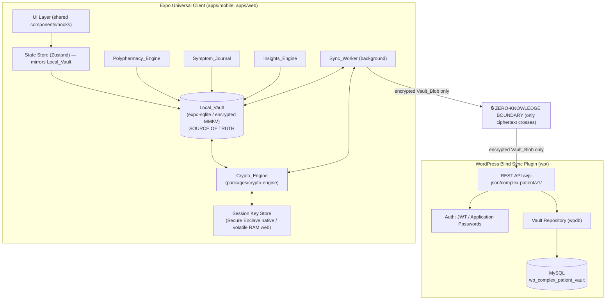
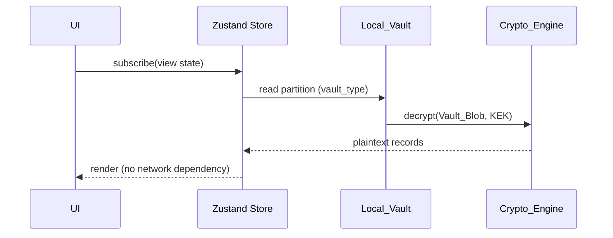
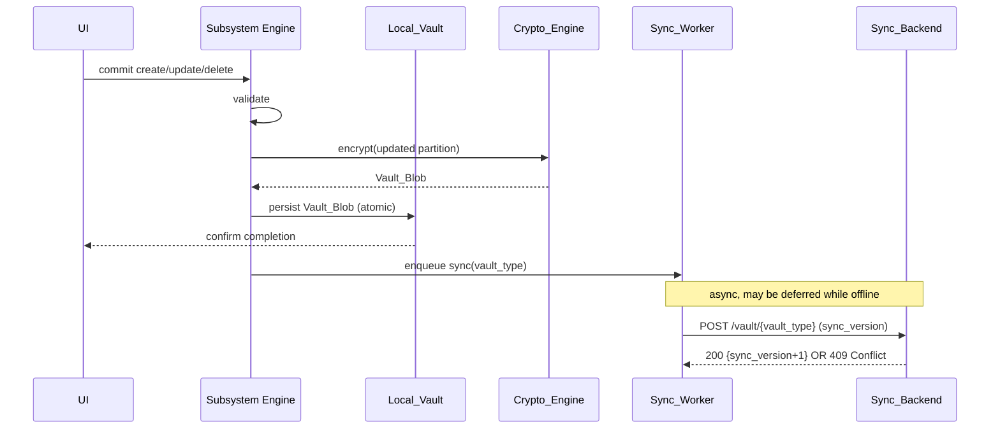
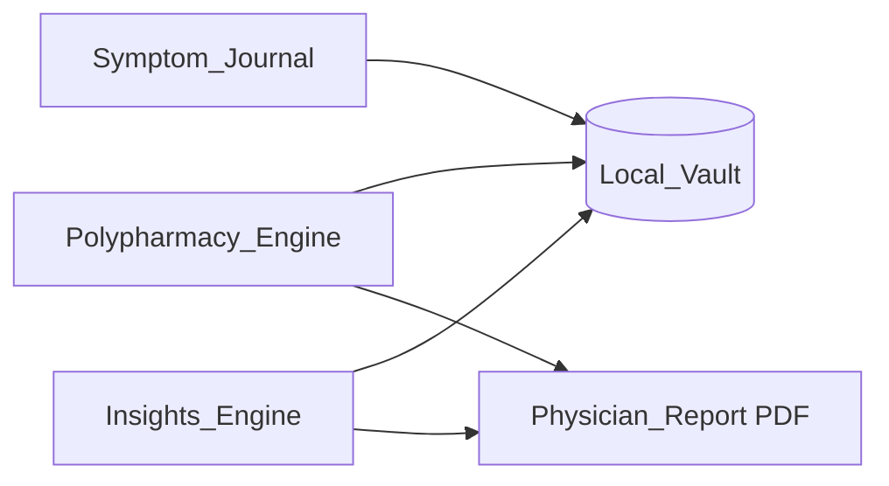
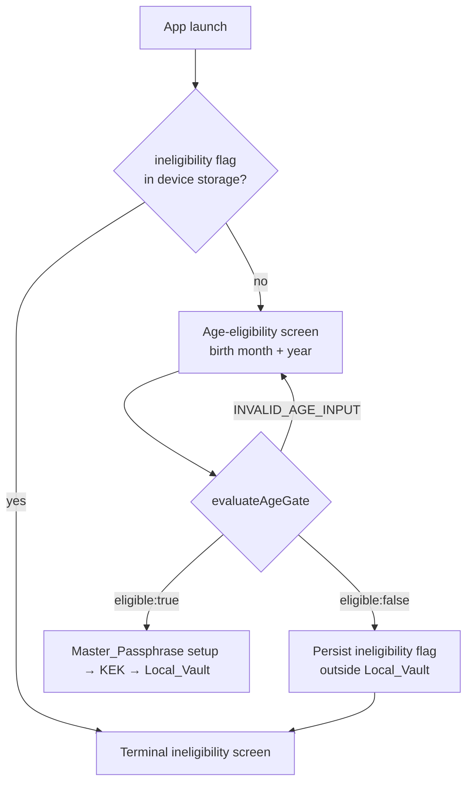
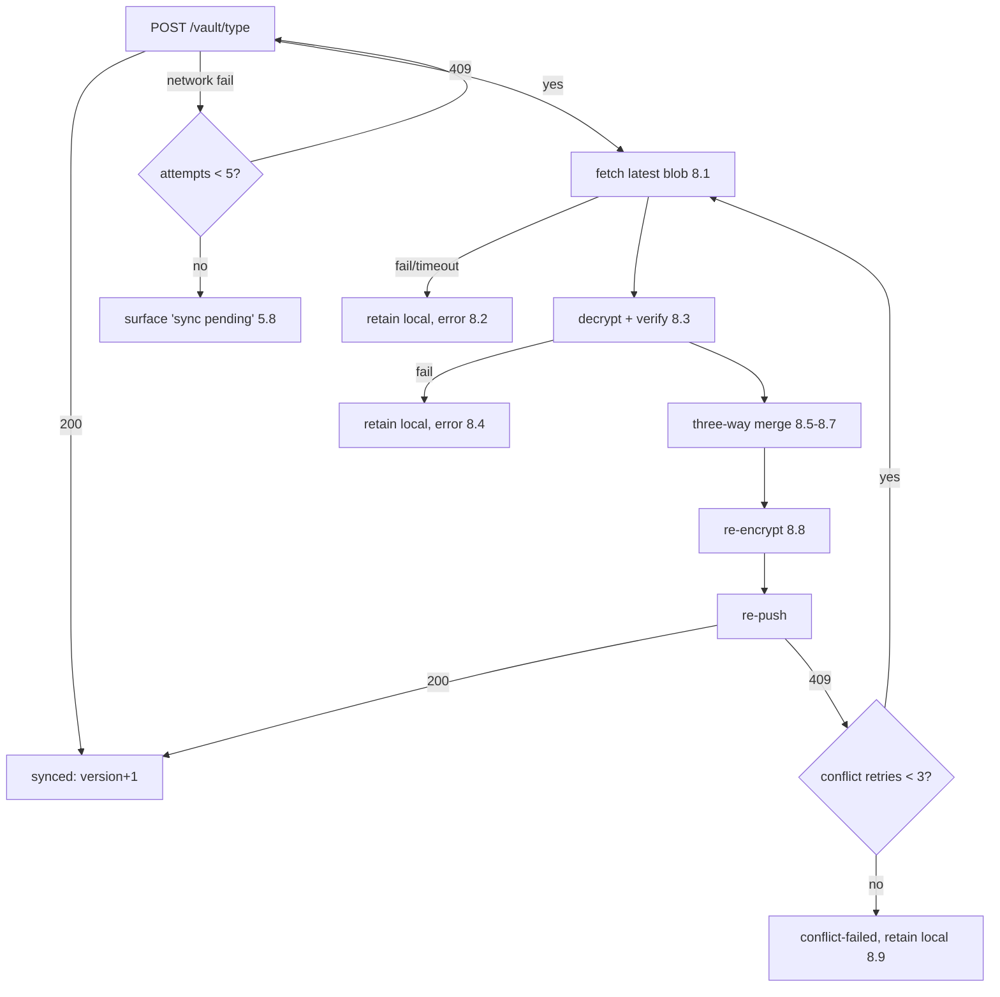

# Design Document: The Complex Patient

## Overview

The Complex Patient is an offline-first, zero-knowledge, end-to-end encrypted (E2EE) digital health platform. It is delivered as a monorepo with two synchronized parts:

1. A **universal Expo client** (`expo/`) targeting iOS, Android, and the web (via React Native Web) from a single shared codebase.
2. A **custom WordPress plugin** (`wp/`) that acts as a structurally *blind* sync engine backend over shared MySQL hosting.

The defining architectural guarantee is **zero-knowledge**: every cryptographic operation (key derivation, encryption, decryption, integrity verification) executes strictly on the client. The server stores and returns only opaque encrypted blobs and never receives plaintext PHI, the Master_Passphrase, or any key material (Requirements 1.3, 1.4, 4.6, 4.8, 19.1, 19.2).

The client treats its local encrypted database (`Local_Vault`) as the single source of truth. The UI reads exclusively from the Local_Vault and never blocks rendering on a server response (Requirement 5.1, 5.2). A background `Sync_Worker` reconciles local state with the server using encrypted opaque blobs, optimistic concurrency control, and a client-side three-way merge (Requirements 5.6, 7, 8).

This design covers six concern areas, each traced to the requirements:

- **Cryptographic design** — `packages/crypto-engine` (Requirements 1, 2, 3, 22.3).
- **Data architecture** — Local_Vault, vault partitioning, MySQL schema, logical data models (Requirements 5, 9, 10, 11, 22.4).
- **Sync engine and backend** — REST endpoints, optimistic concurrency, offline queue, conflict resolution (Requirements 4, 6, 7, 8).
- **Client subsystems** — Polypharmacy_Engine, Symptom_Journal, Insights_Engine (Requirements 10–21).
- **Cross-cutting concerns** — universal platform support, state management, error handling, security (Requirement 22).
- **Correctness Properties & Testing Strategy** — property-based testing for crypto and sync/merge correctness.

### Goals

- Guarantee the server can never learn PHI even if fully compromised.
- Provide complete offline functionality with eventual, conflict-safe synchronization.
- Deliver identical feature parity and identical cryptographic outputs across iOS, Android, and web.

### Non-Goals

- Server-side analytics, search, or any plaintext processing of PHI.
- Multi-user shared vaults or clinician write-access (the report is an on-device, read-only export).
- Account recovery without the Master_Passphrase (zero-knowledge implies no server-side key escrow).

## Architecture

### System Topology

The platform is composed of three synchronized parts that meet at a single trust boundary: the **zero-knowledge boundary**. Plaintext PHI exists only above this boundary, on the client and in client RAM. Below it, only ciphertext, IVs, and authentication tags flow.



### Trust Boundary and Data Flow

- **Above the boundary (trusted, plaintext):** UI, state store, subsystem engines, Local_Vault decryption-in-memory, Crypto_Engine, key store. The Master_Passphrase and KEK never leave this zone (Requirements 1.3, 1.4, 3.5, 4.8).
- **Crossing the boundary (encrypted only):** `Vault_Blob` objects `{ sync_version, iv, auth_tag, ciphertext (Base64) }` (Requirements 2.8, 4.6, 6.2, 6.3).
- **Below the boundary (untrusted, blind):** WordPress REST layer, authorization, MySQL. The backend authenticates the user and scopes storage by `wp_user_id` but cannot interpret the ciphertext (Requirements 4.2, 4.4, 4.6).

### Read and Write Paths

**Read path (always local, never blocks on network) — Requirement 5.2:**



**Write path (local-first, then async sync) — Requirements 5.4, 5.7:**



### Monorepo Layout

```
expo/
  apps/
    mobile/            # iOS + Android entry (Expo Router, expo-secure-store, expo-notifications)
    web/               # React Native Web entry (HTTPS, window.crypto.subtle)
  packages/
    crypto-engine/     # isomorphic crypto: KDF, AES-256-GCM, runtime detection
    local-vault/       # encrypted persistence abstraction (sqlite / MMKV)
    sync-engine/       # Sync_Worker, offline queue, three-way merge
    domain/            # logical data models + validation (meds, symptoms, conditions, flares)
    ui/                # shared components/hooks consumed by mobile + web
    insights/          # sandboxed analytics + PDF report
wp/
  complex-patient/     # plugin bootstrap, activation (dbDelta), REST controllers, repository
```

The `packages/crypto-engine` package is the single source of all cryptographic primitives; every target invokes crypto exclusively through it with no platform-specific reimplementation (Requirement 22.3).

## Components and Interfaces

### Crypto_Engine (`packages/crypto-engine`)

The Crypto_Engine is an isomorphic wrapper that exposes a stable interface and selects a backend provider at runtime.

#### Runtime Provider Selection (Requirements 1.5, 1.6, 1.7, 1.8)

```typescript
type CryptoProvider = 'web-subtle' | 'expo-crypto';

interface RuntimeContext {
  isWeb: boolean;          // React Native Web vs native runtime
  isSecureContext: boolean; // window.isSecureContext on web
  hasSubtle: boolean;      // window.crypto?.subtle present
}

function selectProvider(ctx: RuntimeContext): ProviderDecision {
  // Native runtime → expo-crypto (1.5)
  if (!ctx.isWeb) return { provider: 'expo-crypto' };
  // Web, but non-secure context → refuse (1.8)
  if (!ctx.isSecureContext) return { refuse: 'SECURE_CONTEXT_REQUIRED' };
  // Web + HTTPS + subtle available → Web Crypto API (1.6)
  if (ctx.hasSubtle) return { provider: 'web-subtle' };
  // Ambiguous / uncertain → expo-crypto fallback (1.7)
  return { provider: 'expo-crypto' };
}
```

Runtime detection distinguishes the *runtime* (native vs browser), not the *device*: a browser on iOS/Android still uses Web Crypto over HTTPS (Requirement 1.6). On a non-secure web context the engine refuses all operations and signals `SECURE_CONTEXT_REQUIRED`, surfaced by the UI within 2 seconds (Requirement 1.8).

#### Public Interface

```typescript
interface CryptoEngine {
  // Requirement 1.1: ≥16-byte CSPRNG salt, unique per vault
  generateSalt(): Promise<Uint8Array>; // 16 bytes

  // Requirements 1.2, 1.9, 1.10: derive 256-bit KEK
  deriveKEK(passphrase: string, salt: Uint8Array, params: KdfParams): Promise<DeriveResult>;

  // Requirements 2.1–2.3, 2.8: AES-256-GCM encrypt → Vault_Blob fields
  encrypt(plaintext: Uint8Array, kek: CryptoKeyRef): Promise<EncryptedPayload>;

  // Requirements 2.4–2.7: verify tag, then return plaintext
  decrypt(blob: EncryptedPayload, kek: CryptoKeyRef): Promise<DecryptResult>;
}

interface KdfParams {
  algorithm: 'PBKDF2' | 'Argon2id';
  pbkdf2Iterations?: number;  // ≥ 600_000 (1.2)
  argonMemoryKiB?: number;    // ≥ 65_536 (64 MiB) (1.2)
  argonIterations?: number;
}

interface EncryptedPayload {
  iv: string;        // Base64, 12 bytes decoded (2.2)
  authTag: string;   // Base64, 16 bytes decoded (2.3)
  ciphertext: string; // Base64 (2.8)
}

type DeriveResult =
  | { ok: true; kek: CryptoKeyRef }
  | { ok: false; error: 'PASSPHRASE_TOO_SHORT' | 'DERIVATION_FAILED' | 'SECURE_CONTEXT_REQUIRED' };

type DecryptResult =
  | { ok: true; plaintext: Uint8Array }
  | { ok: false; error: 'AUTH_TAG_FAILED' | 'MALFORMED_BLOB' };
```

#### Key Derivation Rules

- Reject passphrases shorter than 12 characters before any derivation; do not derive a KEK; signal `PASSPHRASE_TOO_SHORT` with a minimum-length message (Requirement 1.9).
- Default to PBKDF2 with ≥600,000 iterations; on platforms with an Argon2id binding, prefer Argon2id with ≥64 MiB memory cost. Parameters are tuned so derivation completes within 5 seconds on target hardware (Requirement 1.2). Parameters are stored alongside the salt (not secret) so the same KEK can be re-derived.
- On any derivation failure, abort, zero out partial key material from memory, and return `DERIVATION_FAILED` (Requirement 1.10).

#### Encryption / Decryption Rules

- Encrypt with AES-256-GCM using a fresh random 12-byte IV per payload and a 16-byte tag (Requirements 2.1–2.3).
- Where the underlying provider returns ciphertext with the tag appended (Web Crypto, expo-crypto), the engine splits the trailing 16 bytes into `authTag` so the on-wire structure is explicit and provider-independent.
- On decrypt, verify the tag before returning any bytes. On failure return `AUTH_TAG_FAILED` and never return partial plaintext (Requirements 2.4–2.6).
- Validate blob structure (presence and decodability of IV, tag, ciphertext) before attempting decryption; reject malformed blobs with `MALFORMED_BLOB` (Requirement 2.7).

### Session Key Store (Requirement 3)

A platform-specific implementation behind a shared interface.

```typescript
interface SessionKeyStore {
  store(kek: CryptoKeyRef): Promise<void>;
  unlock(): Promise<UnlockResult>; // biometric/passphrase per platform
  lock(): Promise<void>;           // discard in-memory KEK
  isUnlocked(): boolean;
}
```

| Concern | Native (iOS/Android) | Web |
|---|---|---|
| KEK persistence | Secure Enclave via `expo-secure-store`, incl. hybrid/webview (3.1) | Volatile RAM only; never persisted (3.5) |
| Unlock | Biometric (FaceID/Fingerprint) before releasing KEK (3.2) | Re-enter Master_Passphrase to re-derive |
| Biometric failure | After 5 consecutive failures: disable biometrics for session, retain KEK in enclave, require passphrase fallback (3.3) | n/a |
| No biometrics | Require Master_Passphrase re-entry (3.4) | n/a |
| Tab close/reload | n/a | Discard KEK, lock vault (3.6) |
| Idle timeout | Discard KEK after 300s inactivity, lock (3.7) | Discard KEK after 300s inactivity, lock (3.7) |
| Locked state | Require Master_Passphrase re-entry before any decrypt (3.8) | Require Master_Passphrase re-entry before any decrypt (3.8) |

A single idle-timer (reset on user interaction) drives the 300s auto-lock on all platforms (Requirement 3.7).

### Local_Vault (`packages/local-vault`)

```typescript
interface LocalVault {
  init(): Promise<void>;                      // 22.4, 22.5
  readPartition(vaultType: VaultType): Promise<Vault_Blob | null>;
  writePartition(vaultType: VaultType, blob: Vault_Blob): Promise<void>; // atomic
  readBase(vaultType: VaultType): Promise<Vault_Blob | null>; // last common synced base
  setBase(vaultType: VaultType, blob: Vault_Blob): Promise<void>;
}
```

- Backed by `expo-sqlite` (default) or encrypted `react-native-mmkv`. All contents are stored encrypted at rest; no plaintext PHI is written to the storage backend (Requirements 22.4, 5.1).
- The Local_Vault is the source of truth. Writes are persisted atomically before completion is confirmed to the user (Requirement 5.4).
- If init/unlock fails, block access to encrypted data, retain previously persisted data unchanged, and present a local-storage-initialization-failed message (Requirement 22.5).

### Sync_Worker (`packages/sync-engine`)

```typescript
interface SyncWorker {
  enqueue(vaultType: VaultType): void;         // 5.6
  onConnectivityRestored(): void;              // begins sync within 30s (5.7)
  syncPartition(vaultType: VaultType): Promise<SyncOutcome>;
}

type SyncOutcome =
  | { status: 'synced'; newVersion: number }
  | { status: 'pending'; attempts: number }   // 5.8
  | { status: 'conflict-resolved'; newVersion: number }
  | { status: 'conflict-failed' };            // 8.9
```

- Background process bridging Local_Vault and Sync_Backend (Requirement 5.6).
- On connectivity restoration, begins syncing affected partitions within 30 seconds (Requirement 5.7).
- On sync failure, retains the affected blob unchanged, retries up to 5 attempts, then surfaces a "sync pending" indicator (Requirement 5.8).
- On 409 Conflict, runs the three-way merge protocol (see below) and re-pushes, retrying the conflict cycle up to 3 additional times (Requirements 8.1–8.9).

### Sync_Backend (`wp/complex-patient`)

```
POST/GET  /wp-json/complex-patient/v1/vault/{vault_type}
```

Registered on `rest_api_init` (Requirement 6.5). Components:

- **Auth middleware** — validates JWT or Application Password; rejects missing/invalid/expired credentials with an authentication-failure response and performs no read/write (Requirements 4.1, 4.3).
- **Authorization** — scopes every operation to the caller's `wp_user_id`; denies cross-user access (Requirements 4.2, 4.4, 4.5).
- **Vault controller** — validates `vault_type` and required encrypted fields; enforces optimistic concurrency; returns blind blobs only (Requirements 6.2–6.8, 7).
- **Repository** — `wpdb`-based access to `wp_complex_patient_vault` with the `(wp_user_id, vault_type)` uniqueness contract (Requirement 9).

#### REST Contract

| Method | Path | Success | Errors |
|---|---|---|---|
| `GET` | `/vault/{vault_type}` | 200 `{ sync_version, iv, auth_tag, ciphertext }` within 5s (6.2) | 401 auth (4.3), 400 unrecognized vault_type (6.6), 404 no data (6.7) |
| `POST` | `/vault/{vault_type}` | 200 `{ sync_version }` (incremented +1) within 5s (6.3, 6.4, 7.5) | 401 auth (4.3), 400 unrecognized vault_type/missing field (6.6, 6.8, 4.7), 409 version conflict w/ current `sync_version` (6.8, 7.2), 400 invalid sync_version (7.6) |

The server stores and returns only `iv`, `auth_tag`, `ciphertext` and never processes their plaintext (Requirements 4.6, 4.8).

### Client Subsystems



- **Polypharmacy_Engine** — medication profile CRUD/validation (R10), complex scheduling (R11), reminders/dashboard indicators (R12), PRN Quick Log + 24h safety threshold (R13), adaptive >10-medication view (R14).
- **Symptom_Journal** — symptom logging + drafts (R15), multi-tagging (R16), batch flare-ups (R17), per-condition timeline (R18).
- **Insights_Engine** — sandboxed 30-day analytics (R19), correlation detection + insight cards (R20), on-device Physician_Report (R21).

Detailed logic for these subsystems is specified in **Data Models** (structures) and **Correctness Properties / Testing Strategy** (behavioral guarantees).

### Age Eligibility Gate (Requirement 23)

The age gate is a pre-vault onboarding step. It runs before Master_Passphrase setup and before any KEK derivation or Local_Vault creation, so an ineligible user never causes an encrypted vault to be created (Requirements 23.1, 23.5). The gate is intentionally a self-attested month/year check applied uniformly with a fixed minimum age of 16 and no locality detection (Requirement 23.2) — it is a stated-eligibility control, not an identity or jurisdiction check.

```typescript
const MINIMUM_AGE_YEARS = 16;

interface AgeGateInput {
  birthMonth: number; // 1–12
  birthYear: number;  // four-digit calendar year
}

type AgeGateResult =
  | { ok: true; eligible: true }
  | { ok: true; eligible: false }                 // valid input, under minimum age → block
  | { ok: false; error: 'INVALID_AGE_INPUT' };     // missing/out-of-range/future month-year

// Pure, deterministic. `now` is injected for testability.
function evaluateAgeGate(input: AgeGateInput, now: Date): AgeGateResult;
```

**Eligibility computation (Requirements 23.3, 23.9):**
- Reject as `INVALID_AGE_INPUT` when the month is not an integer in 1–12, the year is not a four-digit calendar year, or the (year, month) is not strictly in the past relative to `now` (Requirement 23.9).
- Compute the threshold conservatively by treating the birthday as the **end of the supplied birth month**: the user is eligible only when `endOfMonth(birthYear, birthMonth) + 16 years <= now`. This blocks a user who is 15 and 11 months rather than rounding up (Requirement 23.3).
- The function is a pure deterministic function of `(input, now)` with `now` injected, so it is unit- and property-testable without wall-clock dependence.

**Flow and persistence:**



- On ineligibility, the client persists an ineligibility flag in local device storage **outside** the encrypted Local_Vault (e.g., `expo-secure-store`/`AsyncStorage` on native, `localStorage` on web), so it is readable at launch without a KEK and is checked before any onboarding step (Requirements 23.7, 23.8). This flag is not PHI and never touches the vault or the KEK lifecycle.
- The terminal ineligibility screen is non-recoverable within the app: it offers no path back to the age screen, limits actions to closing the app (native) or staying on a neutral page (web), and never redirects to an unrelated third-party site (Requirement 23.6).
- Birth month and birth year are collected solely for this in-memory computation; no full date of birth is collected and neither value is ever placed in a Sync_Backend request body, header, or query parameter (Requirement 23.10). This preserves the zero-knowledge network invariant — the age gate adds no new outbound data.

This logic lives in `packages/domain` as a pure `evaluateAgeGate` function (consumed by the `apps/mobile` and `apps/web` onboarding entry points wired in the universal-client integration), keeping the platform-agnostic rule testable and identical across targets.

## Data Models

### Vault_Blob and Partitioning

PHI is partitioned by `vault_type`. Each partition serializes its plaintext record set to JSON, then encrypts it into a single `Vault_Blob`. The `vault_type` is the unit of sync and optimistic concurrency.

```typescript
type VaultType =
  | 'medications'      // medication profiles + schedules + PRN config + PRN logs
  | 'symptoms'         // symptom entries + drafts
  | 'conditions'       // condition definitions
  | 'flares'           // flare-up events
  | 'associations';    // symptom↔condition and symptom↔medication links

interface Vault_Blob {
  sync_version: number; // optimistic concurrency token; initial stored version = 1 (7.4)
  iv: string;           // Base64, 12 bytes (2.2)
  auth_tag: string;     // Base64, 16 bytes (2.3)
  ciphertext: string;   // Base64 AES-256-GCM ciphertext of the partition JSON (2.8)
}
```

The decrypted partition payload is an envelope that carries the records plus the merge metadata needed for three-way merge:

```typescript
interface PartitionPayload<T extends VaultRecord> {
  records: T[];
}

interface VaultRecord {
  id: string;             // unique record identifier (UUID); merge tiebreak key (8.7, 18.3)
  op_timestamp: string;   // ISO 8601 client-side operational timestamp (10.5, 15.2, 8.6)
  deleted?: boolean;      // soft-delete tombstone to preserve deletes across merges
}
```

### Medication Domain (Requirements 10, 11, 13, 14)

```typescript
interface MedicationProfile extends VaultRecord {
  drugName: string;         // 1–200 chars (10.1, 10.2)
  dosage: string;           // 1–200 chars
  form: string;             // 1–200 chars
  prescribingPhysician: string; // 1–200 chars
  conditionTreated: string; // 1–200 chars
  active: boolean;          // active polypharmacy filter (14.1, 21.1)
  schedule: MedicationSchedule;
  prn?: PrnConfig;          // present iff PRN (11.3, 13)
}

type MedicationSchedule =
  | { kind: 'prn' }                                            // 11.3, 13.2
  | { kind: 'weekly'; daysOfWeek: Weekday[]; times: string[] } // 11.1
  | { kind: 'alternating'; startDate: string; times: string[] }// 11.1
  | { kind: 'rotating-interval'; everyNDays: number /*1–30*/; times: string[] } // 11.1, 11.4
  | { kind: 'taper'; phases: TaperPhase[] /* up to 52 weeks */ }; // 11.2, 11.4

interface TaperPhase { weekIndex: number; dosage: string; } // dosage required (11.2, 11.4)

interface PrnConfig {
  doseAmount: number;          // recorded per Quick Log (13.5)
  doseUnit: string;
  safetyLimit24h: number;      // 0.01–999,999.99 (13.3, 13.4)
}

interface PrnLog extends VaultRecord {
  medicationId: string;
  amount: number;
  takenAt: string;             // used for trailing-24h cumulative (13.5, 13.6)
  override?: boolean;          // acknowledged safety-threshold override (13.7)
}

type Weekday = 'MON'|'TUE'|'WED'|'THU'|'FRI'|'SAT'|'SUN';
type TimeBlock = 'Morning'|'Midday'|'Evening'|'Night/Bedtime';
```

**Validation invariants:**
- All five profile fields non-empty and ≤200 chars, else reject whole profile listing each invalid field (Requirements 10.1, 10.2).
- Schedule validation: at least one selected day for weekly; interval N ∈ [1,30]; every taper phase has a dosage; else reject with a specific message (Requirement 11.4).
- PRN safety limit ∈ [0.01, 999,999.99]; out-of-range rejects and preserves prior limit (Requirements 13.3, 13.4).

**Adaptive view (Requirement 14):** A pure function maps the active daily medication set to a display model.

```typescript
function buildPolypharmacyView(meds: MedicationProfile[]): PolyView;
// >10 active daily → grouped blocks in fixed order [Morning, Midday, Evening, Night/Bedtime] (14.1),
//   alphabetical within block, multi-time meds appear in each matching block (14.3),
//   no-time/PRN → "As Needed" section after Night/Bedtime (14.4), empty blocks omitted (14.5)
// ≤10 active daily → single alphabetical flat list (14.2)
```

Time-block assignment windows: Morning 05:00–10:59, Midday 11:00–16:59, Evening 17:00–21:59, Night/Bedtime 22:00–04:59 (Requirement 14.3).

### Symptom, Condition, Flare Domain (Requirements 15, 16, 17, 18)

```typescript
interface Condition extends VaultRecord {
  name: string;             // e.g., POTS, MCAS, EDS
}

interface SymptomEntry extends VaultRecord {
  symptomType: string;      // non-empty (15.1, 15.3)
  systemicLocation: string; // non-empty (15.1, 15.3)
  severity: number;         // integer 1–10 inclusive (15.1, 15.4)
  duration: { value: number; unit: TimeUnit }; // positive numeric + unit (15.1)
  notes: string;            // ≤2000 chars (15.5)
  active: boolean;          // eligible for flare batch selection (17.1)
}

interface SymptomDraft { /* unsaved fields retained on rejection (15.6) */ }

interface Association extends VaultRecord {
  symptomId: string;
  conditionIds: string[];   // 1–50 existing conditions (16.1, 16.2)
  medicationIds: string[];  // 1–50 medications when flagged adverse (16.3)
}

interface FlareUp extends VaultRecord {
  symptomIds: string[];     // 2–50 active symptoms (17.1, 17.4)
  trigger: string;          // ≤500 chars (17.2)
}

type TimeUnit = 'minutes'|'hours'|'days'|'weeks';
```

**Validation invariants:**
- Symptom: type & location non-empty, severity integer in [1,10], duration positive with unit; reject listing each missing field; severity out-of-range rejects with valid-range message together; notes >2000 chars rejected; rejected entries retained as draft (Requirements 15.1–15.6).
- Associations: 1–50 conditions, 1–50 medications; unknown condition link rejected while retaining other associations; persisted encrypted within 2s; on failure retain editing state and block progression (Requirements 16.1–16.5).
- Flare-up: 2–50 active symptoms; trigger ≤500 chars; persisted with references within 2s; <2 symptoms rejected preserving selection; on storage failure retain data with error (Requirements 17.1–17.5).

**Condition timeline (Requirement 18):** a pure projection function.

```typescript
function buildConditionTimeline(conditionId, symptoms, meds, flares, assoc): TimelineEntry[];
// filters to entries tagged to the condition (18.1), excludes untagged,
// orders by op_timestamp DESC (18.2), ties broken by lexicographically greater id (18.3),
// empty-state when nothing tagged (18.4), otherwise show timeline without empty-state (18.5)
```

### Insights Domain (Requirements 19, 20, 21)

```typescript
interface AnalysisInput {
  symptoms: SymptomEntry[]; // trailing 30 calendar days (19.3, 19.5)
  prnLogs: PrnLog[];
  medEvents: MedEvent[];    // medication adherence/administration events
}

interface CorrelationResult {
  medicationVariable: string;
  symptomVariable: string;
  direction: 'positive'|'negative';
  lagDays: number;          // candidate lags 0–14 (20.1)
  pValue: number;           // significant when ≤ threshold (default 0.05) (20.2)
}

interface AIInsightCard {
  variables: [string, string];
  direction: 'positive'|'negative';
  lagDays: number;
}

interface PhysicianReport {
  activePolypharmacy: MedicationProfile[];        // active at request time (21.1)
  severeSymptomFrequency90d: number;              // severity ≥ severe over trailing 90d (21.4)
  correlations: AIInsightCard[];
  // each section emits "no data available" when empty (21.5)
}
```

**Insights invariants:**
- All computation in client memory sandbox; no raw/derived analytics written to any network-bound buffer, payload, header, or query parameter (Requirements 19.1, 19.2).
- Read trailing 30 calendar days; truncate older data; complete computation within 3s (Requirements 19.3, 19.5); insufficient data (<1 symptom or <1 medication) → skip + message (Requirement 19.6).
- Correlation lags 0–14 days; cards generated only for p ≤ threshold; max 10 cards ascending by p-value (Requirements 20.1, 20.2, 20.5); gating: <14 days history OR <10 paired observations → insufficient-data message and no cards (20.3); sufficient but none significant → no-significant-correlations message (20.4); full analysis result within 10s (20.6).
- Physician_Report compiled fully on-device with no server processing, within 10s; severe-symptom count over trailing 90 days; empty sections explicitly marked; failure retains vault unchanged with error (Requirement 21).

### MySQL Schema (Requirement 9)

Created via `dbDelta` on plugin activation, idempotently (create only if absent so repeated activations succeed) (Requirement 9.1). If creation fails, the entire activation halts with an error and leaves no partial table (Requirement 9.2).

```sql
CREATE TABLE wp_complex_patient_vault (
  id                BIGINT(20) UNSIGNED NOT NULL AUTO_INCREMENT,
  wp_user_id        BIGINT(20) UNSIGNED NOT NULL,
  vault_type        VARCHAR(64) NOT NULL,
  iv                VARCHAR(32) NOT NULL,        -- Base64 of 12-byte IV
  auth_tag          VARCHAR(32) NOT NULL,        -- Base64 of 16-byte tag
  ciphertext        LONGBLOB NOT NULL,           -- (9.4)
  sync_version      BIGINT(20) UNSIGNED NOT NULL DEFAULT 1, -- (7.4)
  client_updated_at DATETIME NULL,
  server_updated_at DATETIME NOT NULL,           -- set on persist (6.4)
  PRIMARY KEY  (id),                             -- auto-increment PK (9.3)
  UNIQUE KEY uniq_user_vault (wp_user_id, vault_type) -- (9.5)
) {$charset_collate};
```

The `(wp_user_id, vault_type)` UNIQUE KEY enforces one current blob per user per partition; a write that would violate it is rejected with a duplicate-identifying error while preserving the existing row (Requirement 9.6). The table stores only encrypted fields and never plaintext (Requirements 4.6, 4.8, 22.4).

### Three-Way Merge Model (Requirement 8)

The merge operates over decrypted partition record sets keyed by `id`:

- **base** — records from the last common synced base (`LocalVault.readBase`).
- **local** — current unsynced local records.
- **remote** — records from the fetched conflicting Vault_Blob.

```typescript
function threeWayMerge<T extends VaultRecord>(base: T[], local: T[], remote: T[]): T[];
// Union of all ids appearing in local or remote (8.5 — keep every non-conflicting record).
// For each id:
//   present in only one side (relative to base) → take that side.
//   present and differing in both → conflict: pick more recent op_timestamp (8.6);
//     on equal timestamps pick lexicographically greater id's record (8.7) [deterministic].
// Result is re-encrypted before re-push (8.8).
```

## State Management

The client uses **Zustand** stores that mirror the decrypted Local_Vault partitions. Stores are hydrated by decrypting partitions on unlock and are updated through the subsystem engines, which always write through to the Local_Vault before the in-memory store reflects the change as committed. This keeps the source-of-truth contract intact (Requirement 5.1, 5.4): the store is a read cache/projection, never an independent source. On lock or idle timeout, stores holding PHI are cleared together with the KEK (Requirements 3.6, 3.7).

## Error Handling

Errors are handled at the layer that owns the failing operation, then surfaced upward with a stable, machine-readable code and a user-facing message. The cross-cutting invariant for every error path is **state preservation**: a failed operation never partially mutates the Local_Vault, the stored server row, or in-memory key material. Below, each error category is mapped to its trigger, the system's recovery behavior, and the guarantee it preserves.

### Crypto Errors (`Crypto_Engine`, Requirements 1, 2)

| Code | Trigger | User-facing behavior | State guarantee |
|---|---|---|---|
| `PASSPHRASE_TOO_SHORT` | Master_Passphrase < 12 chars (1.9) | Minimum-length message; no KEK derived | No derivation attempted; no key material allocated |
| `DERIVATION_FAILED` | KDF throws / runtime error (1.10) | Derivation-failure message; prompt retry | Partial key material zeroized from memory; vault stays locked |
| `SECURE_CONTEXT_REQUIRED` | Web served over non-HTTPS context (1.8) | Secure-context-required message within 2s; all crypto refused | No provider selected; no operation executed |
| `AUTH_TAG_FAILED` | GCM tag verification fails on decrypt (2.4–2.6) | Tampering-or-key-mismatch message | No plaintext or partial plaintext returned to caller |
| `MALFORMED_BLOB` | Missing/undecodable iv, auth_tag, or ciphertext (2.7) | Malformed-vault message | Decryption never attempted; no plaintext returned |

All crypto errors are returned as typed `DeriveResult` / `DecryptResult` values (see Crypto_Engine interface) rather than thrown, so callers must explicitly branch on failure before touching plaintext.

### Sync Errors (`Sync_Worker`, Requirements 5, 8)

- **Offline / transient network failure (5.8):** The affected `Vault_Blob` is retained unchanged in the Local_Vault. The worker retries up to 5 attempts; after the final failed attempt it surfaces a persistent "sync pending" indicator. Local edits remain fully usable offline (5.3).
- **409 conflict cycle (8.1–8.9):** On HTTP 409 the worker fetches the latest blob (within 10s, 8.1), decrypts and integrity-verifies it on-device (8.3), runs the three-way merge, re-encrypts (8.8), and re-pushes. The conflict cycle (re-fetch → re-merge → re-push) is retried up to 3 additional times (8.9).
- **Conflict fetch/verify failure (8.2, 8.4):** If the latest-blob fetch fails or times out (8.2), or if decryption/integrity verification of the fetched blob fails (8.4), the merge is aborted, all unsynced local records are retained unchanged, and a "conflict resolution could not be completed" / "fetched data could not be verified" error is surfaced.
- **Conflict retries exhausted (8.9):** After 3 exhausted conflict retries the worker emits `conflict-failed`, retains all unsynced local records unchanged, and surfaces an error indication.



### Backend Errors (`Sync_Backend`, Requirements 4, 6, 7, 9)

| Condition | Response | State guarantee |
|---|---|---|
| Missing/invalid/expired credentials (4.3) | Authentication-failure indication (401) | No read or write performed |
| Cross-user `wp_user_id` access (4.5) | Authorization-failure indication | Target blob not returned |
| Unrecognized `vault_type` (6.6) | 400 error indication | No stored data read or written |
| Missing required encrypted field — iv/auth_tag/ciphertext (4.7, 6.8) | 400 identifying the missing field | No portion of the request persisted |
| `GET` for vault_type with no data (6.7) | Not-found indication (404) | n/a (read-only) |
| Stale/mismatched `sync_version` (7.2) | 409 Conflict, returns current stored `sync_version` | Stored blob and version left unchanged |
| Missing/non-integer `sync_version` (7.6) | Validation error (invalid sync_version) | Stored blob and version left unchanged |
| `(wp_user_id, vault_type)` UNIQUE KEY violation (9.6) | Error identifying the duplicate combination | Existing row preserved unchanged |
| Vault table creation fails on activation (9.2) | Activation halts with table-creation error | No partially created table left behind |

The backend never inspects ciphertext while handling any of these errors; validation operates only on envelope structure and the optimistic-concurrency token (4.6, 4.8).

### Local Storage Errors (`Local_Vault`, Requirement 22.5)

If Local_Vault initialization or unlock fails, the client blocks access to encrypted health data, retains any previously persisted encrypted data without modification, and presents a "local storage initialization failed" message (22.5). No degraded/plaintext fallback store is ever created.

### Validation Errors (Subsystem Engines, Requirements 10, 11, 13, 15, 16, 17)

Validation is rejection-with-preservation: the engine rejects the whole submission, persists nothing partial, and returns a message identifying each offending field.

- **Medication profile (10.2):** Any of the five fields empty or >200 chars → reject entire profile, store nothing, list each invalid field.
- **Schedule (11.4):** Weekly with no selected day, interval N outside 1–30, or a taper phase missing a dosage → reject, store nothing, identify the invalid scheduling input.
- **PRN safety limit (13.4):** Limit outside 0.01–999,999.99 → reject, preserve the previously stored limit, show out-of-range message.
- **Symptom entry (15.3–15.6):** Missing type/location/severity/duration → reject listing each missing field (15.3); severity non-integer or outside 1–10 → reject with valid-range message presented together with the rejection (15.4); notes >2000 chars → reject with notes-length message (15.5); in all cases the user-entered details are retained as a **draft** so captured information is not lost (15.6).
- **Association (16.2, 16.5):** Linking to a non-existent Condition → reject that link with a not-found message while retaining the user's other associations (16.2); persistence failure → retain unsaved associations in the editing state, show "not saved" error, and block progression until persisted (16.5).
- **Flare-up (17.4, 17.5):** Fewer than 2 active symptoms → reject, preserve current selections, show "minimum of 2 symptoms" message (17.4); storage failure → retain entered Flare_Up data and show "save did not complete" error (17.5).

### Analytics & Report Errors (`Insights_Engine`, Requirements 19, 20, 21)

- **Insufficient data (19.6, 20.3):** <1 symptom or <1 medication in the trailing 30 days → skip variance computation, show insufficient-data message (19.6). <14 days of history OR <10 paired observations → show "more tracking history needed" message and generate no cards (20.3).
- **No significant correlation (20.4):** Thresholds met but nothing at/below the significance threshold → show "analyzed but no significant correlation found" message.
- **Analysis computation failure (19.7):** Show "analysis could not be completed" error, retain all Local_Vault entries unchanged, and transmit no raw symptom or medication data over the network.
- **Report generation failure (21.6):** Retain vault data unchanged and show "report generation failed" error. Empty report sections are explicitly marked "no data available" rather than omitted (21.5).

## Security Considerations

The security model is **zero-knowledge by construction**: confidentiality does not depend on the server being trustworthy. The defining guarantee is that PHI, the Master_Passphrase, and key material exist only above the zero-knowledge boundary (Requirements 1.3, 1.4, 4.6, 4.8, 19.1, 19.2).

### Threat Model

We assume a **fully compromised server**: an attacker with complete read/write access to the WordPress host, the MySQL database, and all data in transit at the backend. Under this assumption the platform must still preserve PHI confidentiality. We additionally consider an attacker who can tamper with stored blobs or replay/alter responses, and an attacker with brief physical access to an unlocked device.

### What the Server Can and Cannot Learn

| Server CAN observe (metadata) | Server CANNOT learn (protected) |
|---|---|
| `wp_user_id` (which account) | Any PHI plaintext — medications, symptoms, conditions, flares, notes |
| `vault_type` (which partition) | The Master_Passphrase |
| `sync_version` (edit counter) | The KEK or any derived key material (4.8) |
| `client_updated_at` / `server_updated_at` timestamps | Salt-to-passphrase mapping usable to recover the passphrase |
| Ciphertext **size** (LONGBLOB length) | Record counts, field values, correlations, or report contents |
| Request cadence / sync frequency | Whether two blobs share any plaintext records |

The backend authenticates and authorizes (scoping by `wp_user_id`, 4.2/4.4/4.5) and enforces optimistic concurrency, but every payload it stores or returns is an opaque `{ iv, auth_tag, ciphertext }` envelope it cannot interpret (4.6).

### Key Material Lifecycle (Requirement 3)

- **Derivation:** KEK is derived on-device from Master_Passphrase + locally generated salt; the passphrase is never persisted and never transmitted (1.3, 1.4).
- **Web:** KEK lives only in volatile RAM, never written to any persistent store; discarded on tab close/reload (3.5, 3.6).
- **Native:** KEK is held in the Secure Enclave via `expo-secure-store`, released only after biometric (or passphrase-fallback) unlock (3.1–3.4).
- **Zeroization:** KEK and PHI-bearing stores are cleared on lock and after 300s idle on all platforms (3.7, 3.8); partial key material is zeroized on derivation failure (1.10).

### Transport & Context

All sync traffic uses HTTPS. On the web the engine additionally requires a **secure context** (`window.isSecureContext`); a non-secure context causes the engine to refuse all cryptographic operations and surface `SECURE_CONTEXT_REQUIRED` within 2 seconds (1.8). This prevents key derivation or decryption from ever running where `window.crypto.subtle` cannot be trusted.

### Authenticated Encryption & Tamper-Evidence

AES-256-GCM provides both confidentiality and integrity. The 16-byte authentication tag is verified before any plaintext is returned; any mutation of ciphertext, IV, or tag yields `AUTH_TAG_FAILED` and never partial plaintext (2.4–2.6). This makes server-side tampering and bit-flipping attacks detectable on the client. During conflict resolution the fetched remote blob is integrity-verified before merge, so a malicious server cannot inject forged records (8.3, 8.4).

### KDF Hardening

Key derivation uses PBKDF2 with ≥600,000 iterations or Argon2id with ≥64 MiB memory cost (1.2), raising the cost of offline brute-force against a stolen ciphertext + salt. A ≥16-byte CSPRNG salt unique per vault (1.1) defeats precomputation/rainbow-table attacks. KDF parameters are stored alongside the (non-secret) salt so the same KEK is reproducible without weakening secrecy.

### No Key Escrow / No Recovery

Consistent with the Non-Goals, there is **no server-side key escrow and no passphrase-recovery path**. A lost Master_Passphrase means the vault is unrecoverable by design — the server holds nothing that can decrypt it. This is an intentional security/usability trade-off that upholds the zero-knowledge guarantee.

### On-Device Analytics Boundary

All analytics run in the client memory sandbox; no raw or derived analytics data is written to any network-bound buffer, payload, header, or query parameter (19.1, 19.2). The Physician_Report PDF is generated entirely on-device with no server-side processing (21.2, 21.3). This invariant is asserted in testing via a network spy (see Testing Strategy).

### Residual Risks & Mitigations

- **Ciphertext-size / timing metadata leakage.** Blob sizes and sync timing can leak coarse signals (e.g., that a partition grew). *Mitigation:* partitioning by `vault_type` limits granularity; optional future padding to size buckets can further blunt size inference. Documented as accepted residual risk.
- **Compromised client / malicious browser extension.** Above-the-boundary compromise is out of scope of the zero-knowledge guarantee. *Mitigation:* secure-context enforcement, Secure Enclave on native, idle/lock zeroization reduce exposure windows.
- **Weak Master_Passphrase.** Zero-knowledge cannot compensate for a guessable passphrase. *Mitigation:* 12-char minimum (1.9) plus KDF hardening (1.2); user guidance toward strong passphrases.
- **Replay of an old valid blob by the server.** *Mitigation:* optimistic concurrency (`sync_version`) and three-way merge surface inconsistencies; stale versions are rejected (7.2).

## Testing Strategy

The platform combines example-based unit tests, property-based tests, integration tests, and cross-platform parity tests. Property-based testing (PBT) is the verification core for the two areas where correctness is universal and high-stakes — **cryptography** and **sync/merge** — plus the pure analytic/view functions. Infrastructure, UI rendering, and one-shot configuration are covered by integration and smoke tests instead.

### Testing Layers

- **Unit (example-based).** Concrete scenarios and error messages: secure-context refusal message within 2s (1.8), biometric 5-failure fallback (3.3), validation messages listing offending fields (10.2, 11.4, 15.3–15.6, 16.2, 17.4), empty-state vs timeline display (18.4, 18.5), report empty-section markers (21.5).
- **Property-based.** Universal invariants over generated inputs using a PBT library for the TypeScript/Expo client — **fast-check** (`@fast-check/vitest`). Each property runs a **minimum of 100 iterations**. The pure functions (`threeWayMerge`, `buildPolypharmacyView`, `buildConditionTimeline`, PRN threshold, insights gating) are tested directly; crypto is tested through the `Crypto_Engine` interface.
- **Integration.** WordPress REST plugin + client `Sync_Worker` end-to-end against a test MySQL: endpoint registration on `rest_api_init` (6.5), `dbDelta` idempotent activation and halt-on-failure (9.1, 9.2), auth/authorization scoping (4.1–4.5), 409 conflict round-trips (7.2, 8.1–8.9). These run 1–3 representative cases, not 100+ iterations.
- **Smoke.** One-time setup/config checks: table presence after activation, plugin boot, secure-context detection wiring.
- **Cross-platform crypto parity.** Run the `web-subtle` and `expo-crypto` provider paths over identical inputs and assert identical KEKs and identical decrypt(encrypt) outputs, including cross-provider decryption (encrypt on one, decrypt on the other), satisfying the "identical cryptographic outputs for identical inputs across all targets" requirement (22.3).

### Property-Based Test Configuration

- Library: `fast-check` with the Vitest binding. Every property test runs `{ numRuns: 100 }` or higher.
- Each property test is tagged with a comment referencing its design property in the form:
  `// Feature: complex-patient-platform, Property {number}: {property_text}`
- Generators are shared in a test fixtures module: random byte buffers (plaintext), valid KEKs, valid/short passphrases, salts, `VaultRecord` sets with controlled id overlap and `op_timestamp` collisions, medication sets straddling the 10-med boundary, PRN log histories spanning the trailing-24h window, and analytics datasets straddling the gating thresholds.

### Testing the Zero-Knowledge Invariant

A **network spy** wraps the HTTP client (and, on web, `fetch`/`XMLHttpRequest`). During randomized analytics and sync runs over generated PHI, the spy captures every outbound request body, header, and query string and asserts that no plaintext PHI or derived analytics value appears in any of them (19.1, 19.2). Only `{ sync_version, iv, auth_tag, ciphertext }` envelopes are permitted to cross the boundary. This is run both as a dedicated property (Property 12) and as an assertion embedded in integration sync tests.

## Correctness Properties

*A property is a characteristic or behavior that should hold true across all valid executions of a system — essentially, a formal statement about what the system should do. Properties serve as the bridge between human-readable specifications and machine-verifiable correctness guarantees.*

The following properties were derived from the acceptance-criteria prework and consolidated to remove redundancy (e.g., tamper-evidence across iv/tag/ciphertext is a single property over "mutate any byte of any component"; KDF determinism and salt-sensitivity are combined). Each property is universally quantified and traces to the requirements it validates.

**Crypto Properties**

### Property 1: Encryption round-trip preserves plaintext

*For any* plaintext byte sequence `P` and any valid KEK `k`, `decrypt(encrypt(P, k), k)` returns `ok` with plaintext exactly equal to `P`.

**Validates: Requirements 2.1, 2.5, 2.8**

### Property 2: Tamper-evidence — mutation always fails closed

*For any* plaintext `P`, valid KEK `k`, and encrypted payload `e = encrypt(P, k)`, mutating any single byte of `e.ciphertext`, `e.iv`, or `e.authTag` causes `decrypt` to return `AUTH_TAG_FAILED` and never returns any plaintext or partial plaintext.

**Validates: Requirements 2.4, 2.6**

### Property 3: Malformed blobs are rejected without decryption

*For any* otherwise-valid payload from which the `iv`, `authTag`, or `ciphertext` field is removed or replaced with a non-decodable value, `decrypt` returns `MALFORMED_BLOB` and returns no plaintext.

**Validates: Requirements 2.7**

### Property 4: IV uniqueness across encryptions

*For any* plaintext `P` and valid KEK `k`, encrypting `P` twice yields two payloads whose IVs differ (and consequently whose ciphertexts differ).

**Validates: Requirements 2.2**

### Property 5: KDF determinism and salt sensitivity

*For any* passphrase `pw` (≥12 chars), salt `s`, and params `prm`, `deriveKEK(pw, s, prm)` computed twice yields identical key bytes; and *for any* two distinct salts `s1 ≠ s2`, `deriveKEK(pw, s1, prm)` differs from `deriveKEK(pw, s2, prm)`.

**Validates: Requirements 1.1, 1.2**

### Property 6: Short passphrases never derive a key

*For any* string shorter than 12 characters, `deriveKEK` returns `PASSPHRASE_TOO_SHORT` and produces no KEK.

**Validates: Requirements 1.9**

### Property 7: Cross-platform crypto parity

*For any* identical inputs, the `web-subtle` and `expo-crypto` providers derive identical KEKs, and a payload encrypted by either provider decrypts to the original plaintext under the other provider.

**Validates: Requirements 22.3**

**Sync & Merge Properties**

### Property 8: Three-way merge loses no non-conflicting data

*For any* base, local, and remote record sets, every non-conflicting record present in either the local or the remote set appears in the merged result.

**Validates: Requirements 8.5**

### Property 9: Deterministic conflict resolution

*For any* pair of conflicting records sharing an id, the merge selects the record with the more recent `op_timestamp`, and on equal timestamps selects the record with the lexicographically greater id; consequently the merge is a deterministic pure function of `(base, local, remote)` — identical inputs always produce identical output.

**Validates: Requirements 8.6, 8.7**

### Property 10: Merge idempotence and convergence

*For any* base, local, and remote sets with merged result `m = threeWayMerge(base, local, remote)`, re-merging `threeWayMerge(base, m, m)` yields a result equal to `m` (as a set); and two devices computing the merge over the same `(base, local, remote)` reach the same merged set.

**Validates: Requirements 8.5, 8.6, 8.7**

### Property 11: Commutativity of non-conflicting union

*For any* base and any local/remote sets whose changes do not conflict, `set(threeWayMerge(base, local, remote)) == set(threeWayMerge(base, remote, local))`.

**Validates: Requirements 8.5**

### Property 12: Zero-knowledge network invariant

*For any* sequence of sync and analytics operations over any generated PHI, no outbound network request body, header, or query parameter contains plaintext PHI or derived analytics values; only `{ sync_version, iv, auth_tag, ciphertext }` envelopes cross the boundary.

**Validates: Requirements 4.6, 4.8, 19.1, 19.2**

### Property 13: Optimistic concurrency correctness

*For any* sequence of writes against a stored partition, a `POST` whose `sync_version` does not equal the stored version is rejected with 409 and leaves the stored blob and version unchanged; a `POST` whose `sync_version` equals the stored version is accepted and increments the stored version by exactly 1.

**Validates: Requirements 7.2, 7.5**

**Domain Logic Properties**

### Property 14: PRN safety threshold enforcement

*For any* PRN configuration, trailing-24-hour log history, and proposed dose amount, the Quick Log is blocked if and only if the resulting trailing-24h cumulative would be strictly greater than the safety limit and no override is acknowledged; otherwise the dose is recorded and the cumulative reflects exactly the added amount.

**Validates: Requirements 13.5, 13.6**

### Property 15: Adaptive polypharmacy view boundary

*For any* set of active daily medications: when the count is greater than 10, the view is grouped into the fixed block order [Morning, Midday, Evening, Night/Bedtime] with members alphabetical within each block, multi-time medications appearing in each matching block, no-time/PRN medications in a trailing "As Needed" section, and empty blocks omitted; when the count is 10 or fewer, the view is a single alphabetical flat list.

**Validates: Requirements 14.1, 14.2, 14.3, 14.4, 14.5**

### Property 16: Condition timeline ordering determinism

*For any* set of records tagged to a Condition, `buildConditionTimeline` returns them ordered by `op_timestamp` descending with ties broken by lexicographically greater id, producing a total, deterministic order (identical inputs always produce identical ordering) and including only tagged entries.

**Validates: Requirements 18.1, 18.2, 18.3**

### Property 17: Insights gating is mutually exclusive and threshold-correct

*For any* trailing-30-day dataset, the Insights_Engine produces exactly one outcome: insufficient-data when fewer than 1 symptom or 1 medication (19.6) or fewer than 14 days of history or fewer than 10 paired observations (20.3); no-significant-correlations when thresholds are met but no correlation is at/below the significance threshold (20.4); otherwise one card per significant correlation, at most 10, ordered by ascending p-value (20.5).

**Validates: Requirements 19.6, 20.3, 20.4, 20.5**

**Onboarding Properties**

### Property 18: Age gate is deterministic and threshold-correct

*For any* birth month/year input and any reference instant `now`, `evaluateAgeGate` produces exactly one outcome: `INVALID_AGE_INPUT` for a missing/out-of-range/non-past month-year; `eligible:false` when the end of the birth month plus 16 years is strictly after `now`; and `eligible:true` when the end of the birth month plus 16 years is on or before `now`. The function is pure and deterministic in `(input, now)`, and an ineligible or invalid result never yields an eligible outcome.

**Validates: Requirements 23.2, 23.3, 23.5, 23.9**
