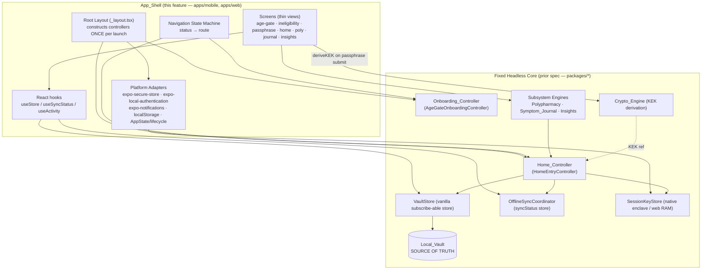
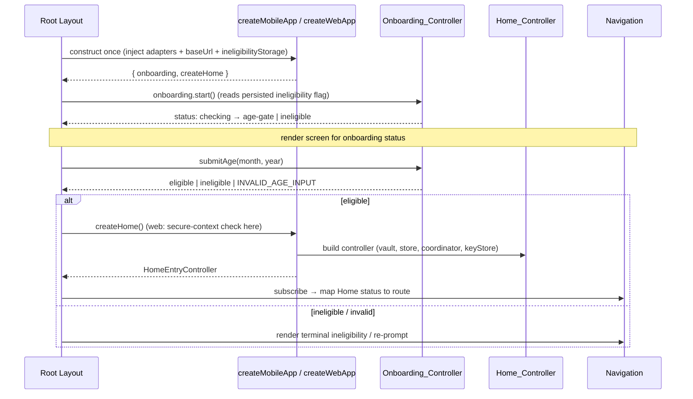
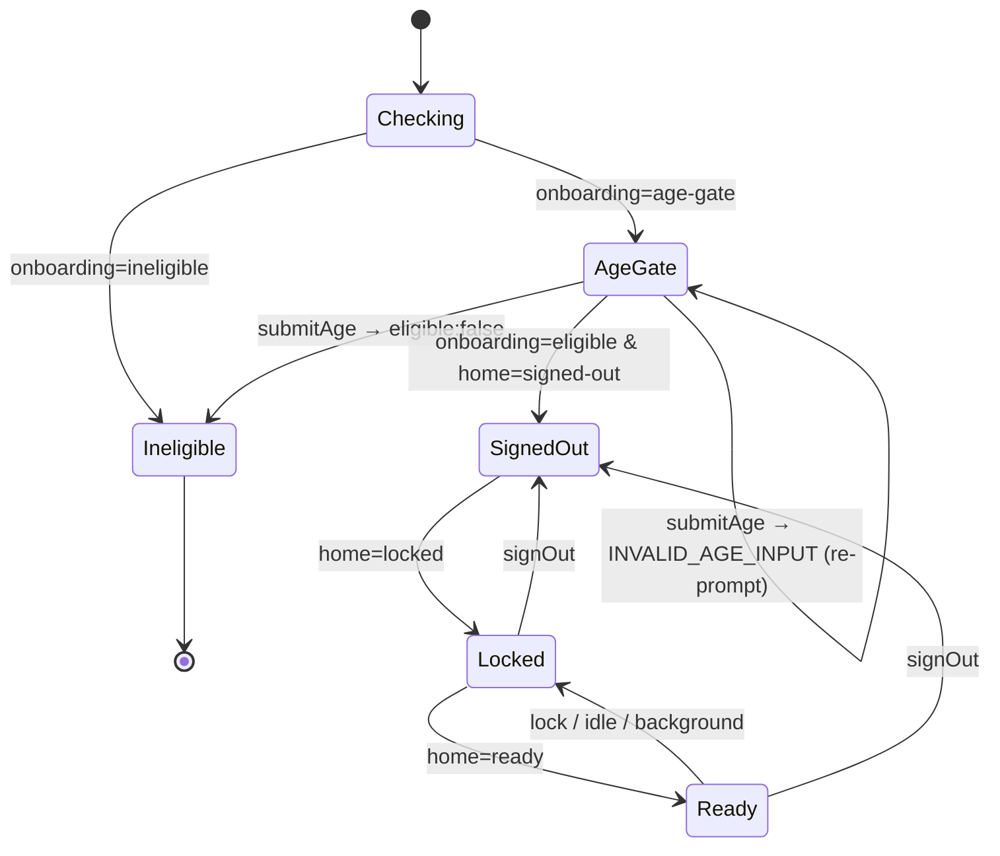

# Design Document: Expo Client App

## Overview

This feature builds the runnable universal **Expo_Client_App** — the React Native / React Native Web UI and app shell — on top of the already-implemented, fully-tested headless logic delivered by the `complex-patient-platform` spec. The prior spec produced the cryptography, Local_Vault, sync engine, subsystem engines, WordPress backend, and the platform-agnostic controllers (`@complex-patient/ui`) and composition roots (`apps/mobile/src/entry.ts`, `apps/web/src/entry.ts`). What it did not produce is anything runnable: there is no React UI, no Expo Router route tree, no valid `app.json`, and the Expo runtime dependencies are not installed, so `yarn expo start` fails to resolve the `expo` module.

This design covers exactly that missing layer:

- **Runtime + configuration** — the Expo SDK version selection, the exact (non-range) runtime dependency set added under Yarn Plug'n'Play without breaking the existing PnP config, and a valid `app.json` (Requirements 1, 2).
- **App shell + navigation** — the Expo Router route tree, a root layout that constructs the controllers once per launch, and a navigation state machine mapping `Onboarding_Controller` and `Home_Controller` statuses to screens (Requirements 3, 4).
- **Platform adapters** — concrete `expo-secure-store` / `expo-local-authentication` / `localStorage` / lifecycle adapters that satisfy the existing key-store and ineligibility-flag interfaces (Requirements 3, 4, 14).
- **Screens** — onboarding, passphrase setup/unlock, authenticated home, and the polypharmacy, symptom-journal, and insights surfaces, each a thin view over the existing controller/engine seams (Requirements 5–11).
- **Cross-cutting UI wiring** — controller/store subscription, sync-status indication, idle auto-lock and lock-on-background, no-PHI-after-lock, and the KEK derivation call from the passphrase screen (Requirements 12, 13, 14).

### Fixed Dependencies (Not Redesigned)

The following are treated as **fixed, pre-built dependencies**. This design consumes their seams and never reimplements or alters them:

| Dependency | Seam consumed |
|---|---|
| `@complex-patient/ui` | `createHomeEntry` → `HomeEntryController`; `createAgeGateOnboarding` → `AgeGateOnboardingController`; `createVaultStore`, `createOfflineSyncCoordinator`, `bindStoreToLock`; the vanilla subscribe-able store |
| `apps/mobile/src/entry.ts` | `createMobileApp` / `createMobileHome`, `MobileEntryOptions`, `MobileApp` |
| `apps/web/src/entry.ts` | `createWebApp` / `createWebHome`, `WebEntryOptions`, `WebApp`, `SecureContextRequiredError` |
| `@complex-patient/key-store` | `SecureStoreAdapter`, `BiometricAdapter`, `KekCodec`, `LifecycleAdapter`, `NativeSessionKeyStore`, `WebSessionKeyStore`, `IdleAutoLock` |
| `@complex-patient/crypto-engine` | `deriveKEK`, `generateSalt`, `detectRuntimeContext`, `selectProvider` |
| `@complex-patient/polypharmacy` | `buildPolypharmacyView`, `PrnQuickLogEngine`, `evaluatePrnQuickLog`, `dispatchMedicationReminder` |
| `@complex-patient/symptom-journal` | `createSymptomJournal`, `createFlareJournal`, `createSymptomAssociations`, `buildConditionTimeline` |
| `@complex-patient/insights` | `detectCorrelations`, `runAnalysis`, `buildPhysicianReport` / `generatePhysicianReport` |
| WordPress backend (`wp/`) | the blind REST sync surface, reached only through the injected `VaultHttpClient` |

### Preserved Invariants

The runnable app MUST preserve the platform's two defining guarantees, established and property-tested by the prior spec:

- **Zero-knowledge.** No PHI, no Master_Passphrase, and no KEK leaves the device. The UI reads and writes PHI *exclusively* through `Home_Controller.read` / `Home_Controller.commit` and the subsystem engines; all cryptography runs through the existing Crypto_Engine on-device (Requirements 14.1, 14.2, 14.6).
- **Offline-first.** The UI reads from the Local_Vault projection and never blocks rendering on the network. Reads and writes complete within 1 second regardless of Sync_Backend reachability (Requirements 12.5, 12.6, 14.4).

### Goals

- Make `yarn expo start` reach a running development-server state on iOS, Android, and Web from one shared codebase.
- Add only the UI/app-shell layer; change no logic package and no backend behavior.
- Keep the navigation state machine, adapters, and secure-context gate small, pure where possible, and testable with React Native Testing Library + vitest.

### Non-Goals

- Re-implementing or modifying any logic package, controller, or the WordPress backend.
- Adding new outbound network calls, analytics, or telemetry.
- Account recovery, multi-user vaults, or any server-side plaintext processing (unchanged platform non-goals).
- Visual design system / theming beyond what each screen needs to satisfy its acceptance criteria.

## Architecture

### Layered View

The Expo_Client_App is a thin presentation shell over the fixed headless core. Plaintext PHI and key material live only inside the controllers and engines (the trusted zone established by the prior design); the React layer added here holds only what the controllers project to it and clears it on lock.



### Composition Sequence (Once Per Launch)

The root layout is the single composition point. It calls `createMobileApp` (native) or `createWebApp` (web) exactly once, drives the age gate, and only then constructs the Home_Controller — preserving the "no vault before eligibility" guarantee baked into the entry points (Requirements 3.1, 3.7, 5.1).



### Navigation State Machine

Navigation is a derived projection of two controller statuses. The shell never stores navigation state independently; it computes the active route from `(onboardingStatus, homeStatus)` and re-derives on every controller notification. This keeps the screen shown provably consistent with controller state (Requirements 3.6, 5.2, 6.1, 7.1, 7.2, 8.1).



The mapping is a pure function (see Components → Navigation Resolver) so it is directly unit- and property-testable.

| Controller condition | Route |
|---|---|
| `onboarding = checking` | loading indicator (no committed screen) |
| `onboarding = age-gate` | `/onboarding/age-gate` |
| `onboarding = ineligible` | `/onboarding/ineligible` (terminal, no back) |
| `onboarding = eligible` ∧ `home = signed-out` | `/auth/sign-in` |
| `onboarding = eligible` ∧ `home = locked` | `/auth/unlock` |
| `onboarding = eligible` ∧ `home = ready` | `/(home)` and subsystem routes |

### Monorepo / Route Layout

The shell adds an Expo Router `app/` tree to each app workspace; everything under `packages/*` is untouched.

```
expo/
  app.json                      # valid Expo config (this feature)
  apps/
    mobile/
      app/                      # Expo Router route tree (native)
        _layout.tsx             # root layout: composes createMobileApp once
        index.tsx               # redirect to resolved route
        onboarding/
          age-gate.tsx
          ineligible.tsx
        auth/
          sign-in.tsx
          unlock.tsx            # passphrase + biometric path
        (home)/
          _layout.tsx           # authenticated stack; activity + lock wiring
          index.tsx             # authenticated home
          polypharmacy/{index,prn}.tsx
          journal/{log,flare,timeline}.tsx
          insights/{index,report}.tsx
      src/entry.ts              # FIXED: createMobileApp / createMobileHome
    web/
      app/                      # identical route tree consumed via RN Web
      src/entry.ts              # FIXED: createWebApp / createWebHome
  packages/                     # FIXED: all logic, untouched
```

Mobile and web share the same screen components from a shared `app-shell` module (co-located in `@complex-patient/ui` UI layer or an `app-shell` package) so the route files are thin per-platform wrappers and feature parity is structural (Requirements 4.1, 8 — identical surface).

### Runtime Dependency & SDK Strategy

The root `package.json` already declares `expo: ^56.0.9`, so the single SDK version for the workspace is **Expo SDK 56** (React Native 0.85.x, React 19.2.x, expo-router 7.x per the Expo SDK 56 release). Requirement 1 mandates **exact versions (no range operators)** that match the bundled set for the chosen SDK, and Requirement 2.2 requires `app.json` `sdkVersion` major to equal the installed `expo` major.

The exact pin set is determined by Expo's own compatibility resolver rather than guessed: the canonical mechanism is `yarn expo install <pkg>` (equivalently `expo install --check` / `--fix`), which writes the SDK-correct exact version into `package.json`. The design records the target versions below; the install step uses `expo install` to confirm/lock them, satisfying Requirement 1.5 (incompatibility is reported and blocks the dev server).

| Package | Workspace | Target (SDK 56) |
|---|---|---|
| `expo` | root | `56.0.x` (drop the `^` to pin exactly) |
| `react` | root | `19.2.x` |
| `react-dom` | root | `19.2.x` |
| `react-native` | root | `0.85.x` |
| `react-native-web` | root | `0.21.x` |
| `expo-router` | root | `7.0.x` |
| `expo-secure-store` | apps/mobile | SDK-56 pin via `expo install` |
| `expo-local-authentication` | apps/mobile | SDK-56 pin via `expo install` |
| `expo-notifications` | apps/mobile | SDK-56 pin via `expo install` |

> The `x` placeholders are replaced with the concrete patch the SDK-56 resolver selects at install time and committed as exact strings (no `^`/`~`). This keeps the declared versions both exact (1.1, 1.2) and SDK-compatible (1.5), and is the only honest way to fix versions without hand-guessing a patch number that the resolver owns.

#### Preserving Yarn Plug'n'Play (Requirement 1.6)

The workspace uses Yarn PnP (`.pnp.cjs`, `.pnp.loader.mjs`, `.yarn/` present; no root `node_modules`). The dependency additions MUST keep `nodeLinker: pnp` and create no root `node_modules`. Concretely:

- Add the runtime deps to the appropriate `package.json` `dependencies` (root for the shared RN/React/router set; `apps/mobile` for the three native Expo modules), then run `yarn install` so Yarn regenerates `.pnp.cjs` — no linker change.
- Native Expo modules that ship platform binaries are surfaced through Yarn's `pnpUnplugged` mechanism (the `.yarn/unplugged/` directory already in the tree), so PnP resolution is preserved while native assets remain on disk.
- A potential friction point is that Metro/Expo historically assume `node_modules`. The design accepts that the dev-server launch is validated against the PnP loader (`.pnp.loader.mjs`); if Metro cannot resolve under PnP, the resolution is fixed via Metro config (`resolver` hooking the PnP API) rather than by switching `nodeLinker`. Switching away from PnP is explicitly out of scope (Requirement 1.6).

### Web Secure-Context Gate

On web, crypto must run only in a Secure_Context. The fixed `createWebApp` defers the secure-context check to `createHome()` (so the age screen can render first), and `createWebHome` throws `SecureContextRequiredError` when `selectProvider(detectRuntimeContext())` refuses. The shell wraps `createHome()` in a try/catch: a `SecureContextRequiredError` routes to a blocking secure-context screen that renders no onboarding/authenticated content and never constructs a Local_Vault (Requirements 4.2, 4.4). `localhost` is treated as a Secure_Context by browsers, satisfying Requirement 4.6 for `yarn expo start --web`.

## Components and Interfaces

All new types below live in the shell layer. They consume the fixed seams; none of them redefine controller or engine behavior.

### Navigation Resolver (pure)

The single source of the status→route mapping. Pure and synchronous so it is exhaustively testable.

```typescript
import type { OnboardingStatus, HomeStatus } from '@complex-patient/ui';

/** Every screen the shell can show. */
export type AppRoute =
  | { name: 'loading' }
  | { name: 'age-gate' }
  | { name: 'ineligible' }
  | { name: 'secure-context-required' } // web-only blocking screen (4.4)
  | { name: 'composition-failed' }      // createHome / createMobileApp failure (3.8, 4.5)
  | { name: 'sign-in' }
  | { name: 'unlock' }
  | { name: 'home' };

/** Inputs to the resolver: the two controller statuses plus shell-level gates. */
export interface NavState {
  onboarding: OnboardingStatus;        // 'checking' | 'age-gate' | 'ineligible' | 'eligible'
  home: HomeStatus | null;             // null until createHome() resolves
  secureContextBlocked: boolean;       // web: createHome threw SecureContextRequiredError
  compositionFailed: boolean;          // createMobileApp/createHome rejected (non-secure-context)
}

/**
 * Pure status→route projection (Requirements 3.6, 4.4, 5.2, 6.1, 6.3, 7.1, 7.2, 8.1).
 * Onboarding gates everything: home routes are only reachable when eligible.
 */
export function resolveRoute(s: NavState): AppRoute {
  if (s.secureContextBlocked) return { name: 'secure-context-required' };
  if (s.compositionFailed) return { name: 'composition-failed' };
  switch (s.onboarding) {
    case 'checking':   return { name: 'loading' };
    case 'age-gate':   return { name: 'age-gate' };
    case 'ineligible': return { name: 'ineligible' };
    case 'eligible':
      switch (s.home) {
        case 'signed-out': return { name: 'sign-in' };
        case 'locked':     return { name: 'unlock' };
        case 'ready':      return { name: 'home' };
        case null:
        default:           return { name: 'loading' };
      }
  }
}
```

### Root Layout / App Host

Constructs the controllers once and exposes them plus reactive nav state to the tree via React context.

```typescript
export interface AppHost {
  /** The age-gate controller, started once on mount (Requirement 5.1). */
  onboarding: AgeGateOnboardingController;
  /** Resolved after eligibility; null until then (Requirements 3.7, 5.2). */
  home: HomeEntryController | null;
  /** Current resolved route, recomputed on every controller notification. */
  route: AppRoute;
  /** Submit the age screen (Requirement 5.5). */
  submitAge(input: { birthMonth: number; birthYear: number }): Promise<void>;
  /** Build the Home_Controller after eligibility; wraps secure-context + failure handling. */
  enterHome(): Promise<void>;
}

/** Platform-specific construction; injected so the tree stays platform-agnostic. */
export interface AppHostFactory {
  createApp(): MobileApp | WebApp; // calls createMobileApp / createWebApp ONCE
}
```

The mobile root layout supplies a factory that calls `createMobileApp` with the concrete native adapters (below); the web root layout supplies one that calls `createWebApp` with the `localStorage` ineligibility adapter and lifecycle hook. The layout subscribes to the onboarding controller (via re-render on `submitAge`/`start` resolution) and, once `home` exists, to the Home_Controller's stores (see Reactivity).

### Platform Adapters

These concrete adapters satisfy the **existing, fixed** key-store and ineligibility interfaces. They are the only place native modules are imported, keeping the rest of the shell testable under vitest.

#### Native: `expo-secure-store` → `SecureStoreAdapter` (Requirement 3.3)

```typescript
import * as SecureStore from 'expo-secure-store';
import type { SecureStoreAdapter } from '@complex-patient/key-store';

const KEK_KEY = 'complex-patient.kek';

export function createExpoSecureStoreAdapter(): SecureStoreAdapter {
  return {
    async setKek(serialized: string): Promise<void> {
      // requireAuthentication gates enclave release behind biometrics (3.x).
      await SecureStore.setItemAsync(KEK_KEY, serialized, {
        keychainAccessible: SecureStore.WHEN_UNLOCKED_THIS_DEVICE_ONLY,
        requireAuthentication: true,
      });
    },
    getKek: () => SecureStore.getItemAsync(KEK_KEY),
    deleteKek: () => SecureStore.deleteItemAsync(KEK_KEY),
  };
}
```

#### Native: `expo-local-authentication` → `BiometricAdapter` (Requirement 3.4)

```typescript
import * as LocalAuthentication from 'expo-local-authentication';
import type { BiometricAdapter } from '@complex-patient/key-store';

export function createExpoBiometricAdapter(): BiometricAdapter {
  return {
    async isAvailable(): Promise<boolean> {
      const hasHw = await LocalAuthentication.hasHardwareAsync();
      const enrolled = await LocalAuthentication.isEnrolledAsync();
      return hasHw && enrolled;
    },
    async authenticate(): Promise<boolean> {
      const res = await LocalAuthentication.authenticateAsync({
        promptMessage: 'Unlock your vault',
        disableDeviceFallback: false,
      });
      return res.success;
    },
  };
}
```

#### `KekCodec` (both platforms)

The KEK's inner material is raw bytes (`wrapKey(Uint8Array)` from the KDF) on native; the codec serializes to Base64 for the enclave and reverses on read. It must round-trip exactly so the same KEK is restored after biometric unlock.

```typescript
import { wrapKey, type CryptoKeyRef } from '@complex-patient/crypto-engine';
import type { KekCodec } from '@complex-patient/key-store';

export function createKekCodec(): KekCodec {
  return {
    serialize(kek: CryptoKeyRef): string {
      const bytes = (kek as unknown as { _inner: Uint8Array })._inner;
      return base64FromBytes(bytes);
    },
    deserialize(serialized: string): CryptoKeyRef {
      return wrapKey(bytesFromBase64(serialized));
    },
  };
}
```

#### Web: `LifecycleAdapter` (Requirement 13.4)

```typescript
import type { LifecycleAdapter } from '@complex-patient/key-store';

export function createWebLifecycleAdapter(): LifecycleAdapter {
  return {
    onTabClose(handler: () => void): void {
      // Either event discards the KEK from volatile RAM (3.6 / 13.4).
      window.addEventListener('beforeunload', handler);
      window.addEventListener('pagehide', handler);
    },
  };
}
```

#### Device ineligibility-flag storage → `DeviceFlagStorage` (Requirement 14.3)

The fixed `createDeviceIneligibilityFlagStore(storage)` adapts any `DeviceFlagStorage` (`getItem`/`setItem`, sync or async). The shell supplies the concrete backing store per platform, kept **outside** the Local_Vault so it is readable at launch without a KEK.

```typescript
import type { DeviceFlagStorage } from '@complex-patient/ui';

// Native: expo-secure-store (or AsyncStorage) — both satisfy DeviceFlagStorage.
import * as SecureStore from 'expo-secure-store';
export const nativeFlagStorage: DeviceFlagStorage = {
  getItem: (k) => SecureStore.getItemAsync(k),
  setItem: (k, v) => SecureStore.setItemAsync(k, v),
};

// Web: localStorage.
export const webFlagStorage: DeviceFlagStorage = {
  getItem: (k) => window.localStorage.getItem(k),
  setItem: (k, v) => { window.localStorage.setItem(k, v); },
};
```

### Reactivity: subscribing React to the controller stores

The Home_Controller exposes two vanilla subscribe-able stores: `coordinator.syncStatus` (sync badges) and the vault store via `coordinator`/`store` (PHI projections). The shell bridges them to React with a `useSyncExternalStore`-based hook, which is the idiomatic, tear-free way to read an external store in React 19.

```typescript
import { useSyncExternalStore } from 'react';
import type { StoreApi } from '@complex-patient/ui';

/** Subscribe a component to a vanilla store slice (tear-free). */
export function useStore<T, S>(store: StoreApi<T>, selector: (s: T) => S): S {
  return useSyncExternalStore(
    store.subscribe,
    () => selector(store.getState()),
    () => selector(store.getState()), // SSR/web snapshot
  );
}

/** Read a PHI partition projection for rendering (local-only; Requirement 8.6, 5.2). */
export function usePartition<T extends VaultRecord>(home: HomeEntryController, vt: VaultType): T[] {
  // Re-read through Home_Controller.read on each store transition.
  useStore(home.coordinator.syncStatus, (s) => s); // subscribe trigger
  return home.read<T>(vt).records;
}

/** Sync_Status indicator state (Requirement 12.1). */
export function useSyncStatus(home: HomeEntryController, vt: VaultType): PartitionSyncStatus {
  return useStore(home.coordinator.syncStatus, (s) => s.partitions[vt]);
}
```

Because the vanilla store notifies subscribers synchronously on `setState`, a coordinator state change propagates to the indicator within one React commit — comfortably inside the 1-second budget (Requirement 12.1). All PHI reads go through `home.read(...)` (never a private cache), so when `lock()` clears the store the next render produces empty records — the mechanism behind no-PHI-after-lock (Requirement 13.5).

### Activity, Idle Auto-Lock, and Lock-on-Background

The shell forwards interaction and lifecycle events to the **existing** lock bindings; it adds no new timer logic (the 300s `IdleAutoLock` is fixed).

```typescript
export interface ActivityWiring {
  /** Attach interaction listeners that call home.notifyActivity() (Requirement 13.1). */
  attachActivity(home: HomeEntryController): () => void;
  /** Attach background/foreground or tab-visibility listeners (Requirements 13.3, 13.4). */
  attachLifecycle(home: HomeEntryController): () => void;
}
```

- **Activity (13.1).** The authenticated stack wraps its content in a root responder. On native, an `onTouchStart`/navigation listener calls `home.notifyActivity()`; on web, `pointerdown`/`keydown`/navigation listeners do the same. Each call resets the fixed 300s `IdleAutoLock`.
- **Idle expiry (13.2).** Already wired in the entry points: `IdleAutoLock` → `controller.lock.lock()`. When the store transitions to `locked`, the resolver routes to `/auth/unlock`. The shell only needs to react to the status change.
- **Lock-on-background, native (13.3).** `AppState.addEventListener('change', s => { if (s !== 'active') void home.lock.lock(); })`. The transition to background triggers `lock()` within one event-loop turn (≪ 1s).
- **Lock-on-reload/close, web (13.4).** Handled by the injected `LifecycleAdapter` (`beforeunload`/`pagehide`) inside `WebSessionKeyStore`, which discards the KEK. `visibilitychange → hidden` additionally calls `home.lock.lock()` to clear PHI projections on tab-hide.
- **No PHI after lock (13.5, 13.6).** `lock()` clears the vault store; all screens read via `home.read`, so cleared projections render empty. If `lock()` rejects, the shell still routes to `/auth/unlock` and unmounts PHI screens (defense in depth for 13.6).

### Passphrase Setup / Unlock Flow and KEK Derivation

The unlock screen is the only place the Crypto_Engine KEK derivation is invoked from the UI. The screen validates the 8–128 length bound *before* deriving (Requirement 7.8 — note: the entry-level minimum is enforced again inside `deriveKEK`, which rejects <12 with `PASSPHRASE_TOO_SHORT`).

```typescript
import { deriveKEK, generateSalt, type CryptoKeyRef } from '@complex-patient/crypto-engine';

const PASSPHRASE_MIN = 8;   // Requirement 7.8 UI bound
const PASSPHRASE_MAX = 128;

export interface PassphraseScreenDeps {
  home: HomeEntryController;
  /** Reads/creates the per-vault salt + KDF params (stored alongside salt, not secret). */
  loadKdfMaterial(): Promise<{ salt: Uint8Array; params: KdfParams } | null>;
  saveKdfMaterial(m: { salt: Uint8Array; params: KdfParams }): Promise<void>;
}

export type PassphraseSubmitResult =
  | { ok: true }                                  // navigated to home
  | { ok: false; reason: 'LENGTH' | 'DERIVATION_FAILED' | 'STILL_LOCKED' };

/** Setup path (first vault) or unlock path (re-derive). Requirement 7.3, 7.6, 7.8, 7.9. */
export async function submitPassphrase(
  deps: PassphraseScreenDeps,
  passphrase: string,
): Promise<PassphraseSubmitResult> {
  if (passphrase.length < PASSPHRASE_MIN || passphrase.length > PASSPHRASE_MAX) {
    return { ok: false, reason: 'LENGTH' };           // no KEK derived (7.8)
  }
  const material = (await deps.loadKdfMaterial())
    ?? { salt: await generateSalt(), params: { algorithm: 'PBKDF2', pbkdf2Iterations: 600_000 } };
  const derived = await deriveKEK(passphrase, material.salt, material.params);
  if (!derived.ok) return { ok: false, reason: 'DERIVATION_FAILED' };
  await deps.saveKdfMaterial(material);               // persist salt+params (not secret)
  const res = await deps.home.unlockWithKek(derived.kek);
  return res.ok ? { ok: true } : { ok: false, reason: 'STILL_LOCKED' }; // 7.9
}

/** Biometric path (native only). Requirements 7.4, 7.5. */
export async function submitBiometric(home: HomeEntryController): Promise<PassphraseSubmitResult | 'FALLBACK'> {
  const res = await home.unlock();
  if (res.ok) return { ok: true };
  // BIOMETRIC_FAILED / BIOMETRIC_LOCKED_OUT → present passphrase re-entry, stay on unlock (7.5).
  if (res.reason === 'BIOMETRIC_FAILED' || res.reason === 'BIOMETRIC_LOCKED_OUT') return 'FALLBACK';
  return { ok: false, reason: 'STILL_LOCKED' };       // other non-ready → stay locked (7.9)
}
```

The Master_Passphrase and derived KEK are passed only to `deriveKEK` / `unlockWithKek` and never placed in any request — the fixed `VaultHttpClient` is the only network egress and carries only the WordPress credential and blind envelopes (Requirements 7.7, 14.2).

### Screen Catalog (thin views over fixed seams)

Each screen is a thin presentation component. The table fixes, per screen, the exact seam it reads from and writes through. Writes always go through `Home_Controller.commit`; reads always through `Home_Controller.read`.

| Screen / Route | Reads (seam) | Writes / actions (seam) | Requirements |
|---|---|---|---|
| Age-gate `/onboarding/age-gate` | `onboarding.getStatus()` | `onboarding.submitAge({birthMonth, birthYear})` | 5.4–5.9 |
| Ineligibility `/onboarding/ineligible` | `onboarding.getStatus()` (terminal) | none (no back control) | 6.1–6.4 |
| Sign-in `/auth/sign-in` | `home.getStatus()` | `home.signIn(WordPressAuth)` | 7.1, 8.2 |
| Unlock `/auth/unlock` | `home.getStatus()` | `submitPassphrase` → `home.unlockWithKek`; `submitBiometric` → `home.unlock` | 7.2–7.9 |
| Home `/(home)` | `home.read(...)` summaries | `home.signOut()`; navigate to subsystems | 8.1, 8.4–8.8 |
| Poly list `/(home)/polypharmacy` | `buildPolypharmacyView(home.read('medications').records)` | navigate; edits via `home.commit('medications', …)` | 9.1–9.3, 9.6, 9.7 |
| PRN quick-log `/(home)/polypharmacy/prn` | `home.read('medications')` (PRN logs) | `PrnQuickLogEngine` path → `home.commit('medications', …)` | 9.4–9.7 |
| Journal log `/(home)/journal/log` | `home.read('symptoms')` | `createSymptomJournal` → `home.commit('symptoms', …)` | 10.1, 10.5–10.8 |
| Flare `/(home)/journal/flare` | `home.read('symptoms')`, `home.read('flares')` | `createFlareJournal` → `home.commit('flares', …)` | 10.2, 10.5–10.8 |
| Timeline `/(home)/journal/timeline` | `buildConditionTimeline(...)` over `home.read(...)` partitions | none (read-only) | 10.3, 10.4 |
| Insights `/(home)/insights` | `detectCorrelations(runAnalysis(home.read(...)))` | none (read-only) | 11.1–11.3, 11.6, 11.7 |
| Report `/(home)/insights/report` | `buildPhysicianReport` over `home.read(...)` | `generatePhysicianReport` (on-device) | 11.4–11.7 |

Key per-screen rules:

- **Poly list (9.2).** Renders `buildPolypharmacyView` blocks in the *exact* returned order — the component maps the `PolyView` structure 1:1 (flat list or ordered `blocks` + trailing `asNeeded`) with no client-side reordering, omission, or insertion. Empty active set → empty-message, no rows (9.3).
- **PRN quick-log (9.4, 9.5).** Routes the entry through the `PrnQuickLogEngine`; the engine's `PrnQuickLogEvaluation` (including any safety-threshold-exceeded result) is rendered before the next entry is accepted. Regimen is never mutated via any other path (9.4).
- **Journal/flare (10.5, 10.6).** On a returned `FieldError`, the screen displays it and *retains* the user's entered values; on success it clears the displayed error. Submissions go only through the journal/flare engine paths (10.1, 10.2).
- **Persistence failure (9.7, 10.8).** When `home.commit(...)` returns `{ ok: false }`, the screen shows a "not saved" message and keeps the entered values in form state (no optimistic clear).
- **Insights gating (11.2, 11.3).** Insufficient-history → insufficient-history message, no cards; zero significant correlations without insufficiency → no-correlations-found message. Report generation runs on-device via the insights report path; failure → report-generation-failure message, stay on insights (11.5). Data-source unavailable → data-unavailable message, block insights (11.7).
- **Home read failure (8.8).** If `home.read` throws / a projection cannot be produced, render a data-unavailable message and no partial PHI.

### Sync-Status Indicator

A single component, mounted in the authenticated stack header, renders a visually distinct state per `PartitionSyncStatus`. It subscribes via `useSyncStatus` and re-renders on coordinator changes (within 1s, 12.1).

| Coordinator state | Indicator | Requirement |
|---|---|---|
| `idle` | "Synced" (neutral) | 12.1 |
| `syncing` | in-progress (spinner) | 12.1, 12.2 |
| `pending` | in-progress / "Sync pending" (distinct from idle) | 12.1, 12.2 |
| `conflict` | "Conflict" (distinct from idle/syncing/pending) | 12.1, 12.3 |

Connectivity restoration is wired by a network-state listener that calls `home.onConnectivityRestored()` within 5 seconds of detecting reachability (12.4). On native this uses the platform reachability event; on web, the `online` event. Controls whose action *requires* a backend response are disabled while unreachable, but all Local_Vault reads/writes/navigation stay enabled (Requirements 14.4, 14.5) — because the write path never awaits the network (it resolves on the local persist), no control that performs a local write is gated.

## Data Models

This feature introduces almost no new persistent data; it consumes the prior spec's models (`VaultType`, `Vault_Blob`, `MedicationProfile`, `SymptomEntry`, `FlareUp`, `Condition`, `Association`, `PrnLog`, `PhysicianReport`, etc.) unchanged. The only new persisted artifact is the **KDF material** the passphrase screen needs to re-derive the same KEK, and the only new in-memory models are the shell's navigation/route state.

### KDF Material (persisted, non-secret)

The salt and KDF params are not secret and must be readable to re-derive the KEK on subsequent unlocks. They are stored **outside** the Local_Vault (alongside the ineligibility flag) so they are available before the vault is unlocked, mirroring the prior design's "parameters stored alongside the salt" note.

```typescript
interface StoredKdfMaterial {
  saltBase64: string;     // Base64 of the ≥16-byte CSPRNG salt (no secret value)
  params: KdfParams;      // algorithm + iteration/memory cost (non-secret)
}
```

Native: `expo-secure-store` / `AsyncStorage`. Web: `localStorage`. This contains no PHI, no passphrase, and no key bytes.

### App Config (`app.json`)

```jsonc
{
  "expo": {
    "name": "The Complex Patient",          // 2.1 non-empty
    "slug": "complex-patient",               // 2.1 non-empty
    "sdkVersion": "56.0.0",                  // 2.2 major == installed expo major
    "platforms": ["ios", "android", "web"],  // 2.3
    "plugins": ["expo-router"],              // 2.4
    "scheme": "complexpatient",              // deep-link scheme for expo-router
    "web": { "bundler": "metro", "output": "single" },
    "extra": {
      "eas": { "projectId": "03afbce3-092b-4382-ba04-8a0b4b34eef9" }  // 2.5 preserved
    }
  }
}
```

The existing `extra.eas.projectId` is preserved verbatim (Requirement 2.5). Missing `name`/`slug`/`sdkVersion` would fail Expo's own schema validation and block the dev server (Requirements 2.6, 2.7) — the shell adds no custom validation beyond Expo's.

### Navigation / route state (in-memory only)

`NavState` and `AppRoute` (above) are ephemeral, derived per render from controller statuses and the two shell gates (`secureContextBlocked`, `compositionFailed`). They hold no PHI and are never persisted or transmitted.

## Error Handling

The shell owns no business-logic error paths — those belong to the fixed controllers and engines, which return typed results (never throw across the boundary). The shell's job is to **surface** each failure on the right screen while preserving the platform invariants (no PHI leak, no vault before eligibility, no blocking on the network). Every failure resolves to a specific route or in-screen message; none leaves a partial or stale PHI render.

| Failure | Trigger | Shell behavior | Invariant preserved |
|---|---|---|---|
| Dependency incompatibility | `expo install --check` / dev-server boot reports an incompatible runtime dep (1.5) | Dev server blocked; report dep name + expected range | No half-configured runtime |
| Missing `app.json` field | Expo schema validation fails (2.7) | Dev server blocked; report missing field | No invalid config loaded |
| Secure-context refused (web) | `selectProvider(detectRuntimeContext())` refuses (4.4) | Route → `secure-context-required`; no `createHome`, no Local_Vault, no onboarding/auth screen | Crypto never runs over plain HTTP |
| Onboarding start failure | `onboarding.start()` rejects (5.3) | Show "onboarding could not start"; no age-gate, no vault | No vault before eligibility |
| Composition failure | `createMobileApp` / `createHome` rejects for a non-secure-context reason (3.8, 4.5) | Route → `composition-failed`; no onboarding/auth screen, no Local_Vault | No vault on failed composition |
| Home build before eligible | shell asks for home while `onboarding ≠ eligible` (3.7) | Entry guard rejects; stay on current screen; no vault | No vault before eligibility |
| Invalid age input | `submitAge` → `INVALID_AGE_INPUT` (5.6) | Re-prompt; stay on age-gate | Birth data never stored/sent |
| Passphrase length | length outside 8–128 (7.8) | Length message; no KEK derived | No weak/oversized derivation |
| Derivation failure | `deriveKEK` → `DERIVATION_FAILED` (7.x) | Derivation-failure message; stay on unlock; vault stays locked | KEK material zeroized by engine |
| Biometric failure | `unlock` → `BIOMETRIC_FAILED` / `BIOMETRIC_LOCKED_OUT` (7.5) | Present passphrase re-entry; stay on unlock | KEK retained in enclave |
| Non-ready unlock | `unlock`/`unlockWithKek` → other non-ready (7.9) | Preserve locked state; stay on unlock | No premature `ready` |
| Read failure | `Home_Controller.read` cannot project (8.8, 11.7) | Data-unavailable message; render no stale/partial PHI | No stale PHI |
| Commit failure | `Home_Controller.commit` → `{ ok: false }` (9.7, 10.8) | "Not saved" message; retain entered values | No partial vault mutation |
| Report failure | insights report path fails (11.5) | Report-generation-failure message; stay on insights | Vault unchanged |
| Lock failure | `lock.lock()` rejects (13.6) | Still clear rendered PHI; route → unlock | No PHI after lock |
| Terminal-screen render failure | ineligibility screen fails to render (6.4) | Fall back to age-gate | Always a defined screen |

## Correctness Properties

*A property is a characteristic or behavior that should hold true across all valid executions of a system — essentially, a formal statement about what the system should do. Properties serve as the bridge between human-readable specifications and machine-verifiable correctness guarantees.*

### Scope of Testing for This Feature

The `complex-patient-platform` spec already property-tested the high-stakes universal logic: cryptography, sync/merge, the age-gate rule, the adaptive polypharmacy view, the condition timeline, PRN safety, and insights gating. **This feature does not re-test that logic.** Instead it focuses on the *new* surface introduced here:

- the **navigation state machine** (status → screen mapping),
- **adapter conformance** to the fixed key-store / device-storage interfaces,
- the **web secure-context gate**,
- **no-PHI-after-lock**,
- **offline-first / no-network-block** rendering, and
- the **zero-knowledge network invariant** as exercised by UI-driven flows.

Each property below was derived from the acceptance-criteria prework and consolidated to remove redundancy. For example, the per-status routing criteria (3.6, 5.2, 5.7, 6.1, 6.3, 7.1, 7.2, 7.6, 8.1–8.3) collapse into one resolver property; the polypharmacy and timeline rendering-fidelity criteria (9.2, 10.3) collapse into one ordering-preservation property; the four zero-knowledge network criteria (5.9, 7.7, 11.4, 14.2) collapse into one network-invariant property; and the offline read/write criteria (12.5, 12.6, 14.4) collapse into one offline-first property.

### Test Configuration

These property-based tests use **fast-check** (`@fast-check/vitest`), the library already adopted by the platform, at a **minimum of 100 iterations** each. Each test carries a tag comment referencing its design property in the form `// Feature: expo-client-app, Property <number> - <text>`.

### Property 1: Navigation is a total, correct projection of controller status

*For any* combination of `OnboardingStatus` and (`HomeStatus | null`) plus the two shell gates (`secureContextBlocked`, `compositionFailed`), `resolveRoute` returns exactly the route prescribed by the status→route table, is defined for every combination, and never returns an authenticated route (`sign-in`, `unlock`, `home`) unless `onboarding = eligible`.

**Validates: Requirements 3.6, 3.7, 5.2, 5.7, 6.1, 6.3, 7.1, 7.2, 7.6, 8.1, 8.2, 8.3**

### Property 2: Web secure-context gate blocks exactly when crypto would be refused

*For any* `RuntimeContext`, the shell sets `secureContextBlocked = true` (routing to the secure-context-required screen with no Local_Vault and no onboarding/authenticated screen) **if and only if** `selectProvider(detectRuntimeContext())` returns the `SECURE_CONTEXT_REQUIRED` refusal.

**Validates: Requirements 4.2, 4.3, 4.4**

### Property 3: Age re-prompt is shown exactly on invalid input

*For any* `AgeSubmissionResult` returned by `onboarding.submitAge`, the age-gate screen displays the re-prompt message **if and only if** the result is `INVALID_AGE_INPUT`, and remains on the age-gate screen in that case.

**Validates: Requirements 5.6, 5.8**

### Property 4: Passphrase derivation occurs exactly within the length bound

*For any* string `p`, `submitPassphrase` invokes `deriveKEK` **if and only if** `8 ≤ p.length ≤ 128`; outside the bound it returns a `LENGTH` result, derives no KEK, and never calls `unlockWithKek`.

**Validates: Requirements 7.8**

### Property 5: Rendered PHI equals the Home_Controller projection

*For any* generated partition projection, every screen renders exactly the records returned by `Home_Controller.read(vaultType)` — no record sourced from any other store, cache, or network response appears, and none of `read`'s records is dropped.

**Validates: Requirements 8.6, 11.6, 14.1**

### Property 6: Rendering preserves engine-produced order and structure

*For any* `PolyView` produced by `buildPolypharmacyView` and *for any* timeline produced by `buildConditionTimeline`, the flattened sequence the screen renders equals the engine's produced sequence exactly — same elements, same order, with no block/entry omitted, reordered, or inserted (the timeline is presented in the order required by 10.3).

**Validates: Requirements 9.1, 9.2, 9.3, 10.3, 10.4**

### Property 7: A failed commit retains entered values and reports non-persistence

*For any* medication, PRN, symptom, or flare edit, when `Home_Controller.commit` returns `{ ok: false }`, the screen displays a "not saved" message and the form still contains every value the user entered (no optimistic clear, no partial PHI loss).

**Validates: Requirements 9.7, 10.8**

### Property 8: Field-error display round-trips with submission outcome

*For any* sequence of subsystem submissions, after a submission that returns a `FieldError` the screen shows that field error and retains the entered values, and after any subsequent successful submission the displayed field error is cleared.

**Validates: Requirements 10.5, 10.6**

### Property 9: Sync-status indicator is a total, injective mapping

*For any* `PartitionSyncStatus` (`idle`, `syncing`, `pending`, `conflict`), the indicator renders the mapped visual state; the four mapped states are pairwise distinct; and `pending` and `syncing` both render a non-idle in-progress state.

**Validates: Requirements 12.1, 12.2, 12.3**

### Property 10: Reads and writes never block on the network

*For any* seeded partition and *for any* transport that is unreachable or never resolves, `Home_Controller.read` returns the local records synchronously and `Home_Controller.commit` resolves on the local persist — neither awaits nor is gated by a Sync_Backend response, and no blocking network request precedes the local result.

**Validates: Requirements 12.5, 12.6, 14.4**

### Property 11: No PHI survives a lock

*For any* set of PHI rendered while `ready`, after `lock()` (explicit, idle, or background) `Home_Controller.read` returns empty projections for every partition, so every screen re-renders with none of the previously displayed PHI present.

**Validates: Requirements 13.5, 13.6**

### Property 12: Zero-knowledge network invariant holds for all UI-driven flows

*For any* sequence of UI operations over generated PHI (age submission, passphrase entry, subsystem edits, report generation, sync), no outbound network request body, header, or query parameter contains the submitted birth month/year, the Master_Passphrase, the KEK, or plaintext PHI; only the WordPress credential and `{ sync_version, iv, auth_tag, ciphertext }` envelopes cross the boundary.

**Validates: Requirements 5.9, 7.7, 11.4, 14.2, 14.6**

### Property 13: Platform adapters conform to the fixed key-store contracts

*For any* KEK key bytes, `KekCodec.deserialize(KekCodec.serialize(kek))` yields a `CryptoKeyRef` with identical key material (round-trip); and *for any* value, the `SecureStoreAdapter` (and the `DeviceFlagStorage` backing the ineligibility flag) returns that value on `get` after `set`, and `null` after `delete` — exercised against an in-memory backend implementing the same contract.

**Validates: Requirements 3.3, 3.4, 14.3**

## Testing Strategy

### Testing Layers

- **Property-based (fast-check, ≥100 iterations).** Properties 1–13 above. The pure pieces (`resolveRoute`, the indicator mapping, the secure-context gate, the length gate) are tested directly. The rendering and lock properties use **React Native Testing Library (RNTL)** to mount screens with a fake `HomeEntryController`/store and assert the rendered tree. The network-invariant property reuses the platform's **network-spy** pattern over a fake transport.

- **Component / unit (example-based, RNTL + vitest).** The example-classified criteria: controllers constructed exactly once (3.1); adapter injection into `createMobileApp` (3.2–3.5); composition-failure screen (3.8, 4.5); `start()` ordering and failure (5.1, 5.3); age-gate inputs present (5.4, 5.5); ineligibility screen has no back control and its render-failure fallback (6.2, 6.4); KEK forwarded to `unlockWithKek` (7.3); biometric wiring and fallback (7.4, 7.5, 7.9); home nav entries and sign-out (8.4, 8.5, 8.7); read-failure data-unavailable (8.8); PRN routing and threshold display (9.4, 9.5); commit-only writers (9.6, 10.7); journal/flare routing (10.1, 10.2); insights presence/gating/error branches (11.1–11.3, 11.5, 11.7); activity/idle/background/lifecycle wiring (13.1–13.4); connectivity-restored wiring (12.4); disabled backend-only controls (14.5); lock-failure clears PHI (13.6).

- **Integration.** Expo dependency resolution and SDK compatibility (1.3, 1.5) via `expo install --check`; `app.json` schema load / missing-field block (2.6, 2.7). These run 1–3 representative cases, not 100+ iterations. The existing `apps/mobile` / `apps/web` `universal-e2e.integration.test.ts` suites already exercise the controller end-to-end and are extended only where the shell adds wiring.

- **Smoke (single execution).** Exact-version pins and no range operators (1.1, 1.2); `yarn expo start` reaches a running state and prints a URL (1.4); PnP preserved with no root `node_modules` (1.6); `app.json` required fields and preserved `projectId` (2.1–2.5); `yarn expo start --web` serves a secure context (4.6).

### Notes on Test Design

- **No native modules in unit/property tests.** Every adapter is injected, so screens and the navigation resolver test under the vitest node environment without `expo-secure-store`, `expo-local-authentication`, or `expo-notifications`. The concrete adapters are tested for conformance (Property 13) against in-memory backends that implement the same interface the real modules satisfy.
- **Fake timers for lock behavior.** The 300s `IdleAutoLock` is the fixed implementation; idle/lock tests advance fake timers and assert the shell reacts to the resulting status change (route → unlock, PHI cleared) rather than re-testing the timer.
- **PBT is intentionally scoped out** of the dependency/config and pure-UI-presence criteria: installing packages, reading `app.json`, and asserting a static screen contains a control do not vary meaningfully with input, so they are smoke/integration/example tests rather than properties.
