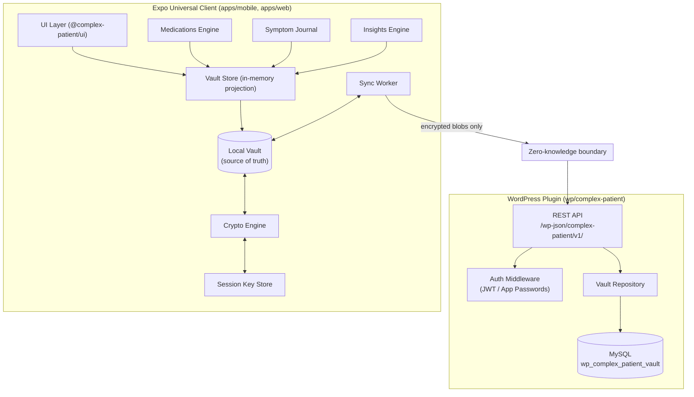
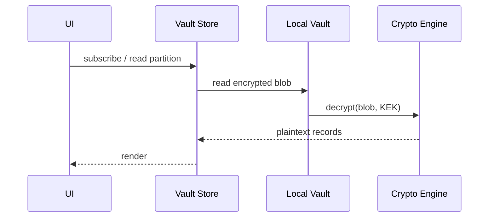
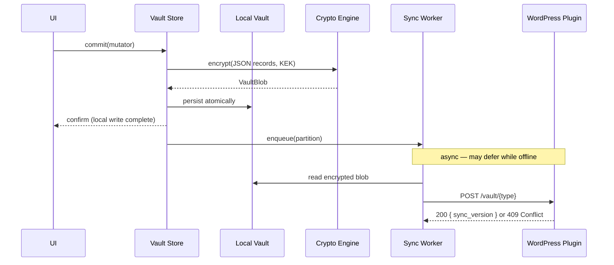

# The Complex Patient — Architecture

The Complex Patient is an offline-first, zero-knowledge, end-to-end encrypted (E2EE) digital health platform. Users track medications, symptoms, conditions, flares, and related associations on their device. Health data is encrypted before it ever leaves the client. The server stores only opaque encrypted blobs and cannot read plaintext PHI even if fully compromised.

The codebase is a monorepo with two main parts:

| Part | Location | Role |
|------|----------|------|
| **Universal Expo client** | `expo/` | iOS, Android, and web from one shared codebase |
| **WordPress sync plugin** | `wp/complex-patient/` | Blind encrypted blob store over MySQL |

### Production URLs

| Surface | URL | Role |
|---------|-----|------|
| **WordPress site** | [thecomplexpatient.com](https://thecomplexpatient.com/) | WordPress host; also serves the blind sync REST API |
| **Expo web app** | [thecomplexpatient.com/secure](https://thecomplexpatient.com/secure) | Static web client — encrypts/decrypts in the browser |
| **Architecture docs** | [source.thecomplexpatient.com](https://source.thecomplexpatient.com/) | This guide, published via GitHub Pages |

WordPress and the web app share the same domain but different paths. The web client at `/secure` calls the sync API on the WordPress origin:

```
https://thecomplexpatient.com/wp-json/complex-patient/v1/vault/{vault_type}
```

The web bundle is built with `baseUrl: /secure` in `expo/app.json` so assets and client-side routing work under that subdirectory.

---

## Core architectural guarantee: zero-knowledge

Plaintext health data exists only on the client—in memory while the vault is unlocked, and as encrypted blobs at rest. A hard trust boundary separates the client from the backend:

```
┌─────────────────────────────────────────────────────────────┐
│  CLIENT (trusted)                                           │
│  Master passphrase → KEK → decrypt/encrypt → UI             │
│  Local vault is the source of truth                         │
└───────────────────────────┬─────────────────────────────────┘
                            │  Only ciphertext crosses this line
                            │  { sync_version, iv, auth_tag, ciphertext }
                            ▼
┌─────────────────────────────────────────────────────────────┐
│  WORDPRESS BACKEND (untrusted / blind)                      │
│  Auth + blob storage only — no decryption, search, or PHI   │
└─────────────────────────────────────────────────────────────┘
```

Two separate credentials protect different things:

| Credential | Purpose | Sent to server? |
|------------|---------|-----------------|
| **WordPress credential** (JWT or Application Password) | Authenticates sync requests to the backend | Yes — `Authorization` header only |
| **Master passphrase → KEK** | Encrypts and decrypts local vault data | Never |

Signing in to WordPress does not unlock the vault. Unlock is a separate step requiring the master passphrase (or biometrics on native, which retrieves a KEK already stored in the Secure Enclave).

---

## System topology



---

## WordPress plugin: blind blob storage

The WordPress plugin is **not** a cloud object store (no S3, Azure Blob, etc.). It is a **blind sync engine** that persists encrypted vault partitions in MySQL. The server never sees plaintext, passphrases, or key material.

### Plugin layout

```
wp/complex-patient/
├── complex-patient.php          # Bootstrap: autoload, activation, REST registration
├── src/
│   ├── Activation.php           # Creates DB table on plugin activate
│   ├── VaultRepository.php      # MySQL read/write for encrypted blobs
│   ├── Rest/VaultController.php # GET/POST vault endpoints
│   └── Auth/
│       ├── AuthMiddleware.php   # JWT / Application Password auth
│       └── AuthResult.php       # Typed auth outcomes
└── tests/                       # PHPUnit unit + integration tests
```

Install by symlinking into `wp-content/plugins/complex-patient`, running `composer install`, and activating in WP Admin. See [dev.md](https://github.com/Digital-Defiance/the-complex-patient/blob/main/dev.md) for local setup.

### Database schema

On activation, the plugin creates `wp_{prefix}complex_patient_vault`:

| Column | Purpose |
|--------|---------|
| `wp_user_id` | WordPress user — all access scoped to authenticated user |
| `vault_type` | Partition name (see below) |
| `iv`, `auth_tag`, `ciphertext` | Opaque encrypted envelope (`ciphertext` is `LONGBLOB`) |
| `sync_version` | Optimistic concurrency counter |
| `client_updated_at` | Optional client timestamp |
| `server_updated_at` | Set on every persist |

One row per `(wp_user_id, vault_type)` — a user has at most one encrypted blob per partition.

### REST API

Namespace: `complex-patient/v1`

| Method | Path | Success response |
|--------|------|------------------|
| **GET** | `/wp-json/complex-patient/v1/vault/{vault_type}` | `{ sync_version, iv, auth_tag, ciphertext }` |
| **POST** | `/wp-json/complex-patient/v1/vault/{vault_type}` | `{ sync_version }` |

Recognized `vault_type` values (must match the client):

- `medications`
- `symptoms`
- `conditions`
- `flares`
- `associations`

**POST body** (all encrypted fields required):

```json
{
  "sync_version": 1,
  "iv": "<base64>",
  "auth_tag": "<base64>",
  "ciphertext": "<base64>",
  "client_updated_at": "2026-06-14T12:00:00.000Z"
}
```

**Error responses:**

| Code | Meaning |
|------|---------|
| **400** | Unknown vault type, missing/empty encrypted field, invalid `sync_version` |
| **401** | Missing or invalid credentials |
| **403** | Attempt to access another user's vault |
| **404** | GET when no blob exists for that partition |
| **409** | `sync_version` mismatch — stale write (response includes current version) |

### Authentication

`AuthMiddleware` runs in the REST `permission_callback` before any handler executes. Unauthenticated requests never reach storage.

Supported methods:

- **JWT Bearer** — `Authorization: Bearer <token>`
- **Application Passwords** — HTTP Basic with WordPress username + app password

Every operation is scoped to the authenticated WordPress user's ID. The middleware also rejects request bodies containing key-material field names (`passphrase`, `kek`, etc.).

### What the plugin deliberately does not do

- Decrypt or inspect blob contents
- Search, index, or analyze health data
- Provide account recovery or key escrow
- Run server-side analytics

---

## Expo client: universal monorepo

The client is a Yarn workspaces monorepo under `expo/`. Mobile (iOS/Android) and web share the same feature surface, screens, crypto, sync logic, and domain models. Platform-specific code is limited to adapters (secure storage, biometrics, notifications, lifecycle).

### Monorepo layout

```
expo/
├── apps/
│   ├── mobile/              # iOS + Android (Expo Router, Secure Enclave, push notifications)
│   └── web/                 # React Native Web (HTTPS + Web Crypto required)
├── packages/
│   ├── crypto-engine/       # KDF, AES-256-GCM, runtime provider selection
│   ├── local-vault/         # Encrypted-at-rest persistence
│   ├── key-store/           # Session KEK storage + idle auto-lock
│   ├── sync-engine/         # Background sync, offline queue, 3-way merge
│   ├── domain/              # Vault types, record models, validation
│   ├── ui/                  # Controllers, vault store, HTTP client, shared screens
│   ├── medications/         # Polypharmacy engine (schedules, PRN safety)
│   ├── symptom-journal/     # Symptom logging, flares, condition timeline
│   └── insights/            # Sandboxed analytics + physician PDF report
├── app.json                 # Expo config (Router root: apps/mobile/app)
├── metro.config.js          # Metro bundler + crypto shim for React Native
└── crypto-shim.js           # Hermes-compatible node:crypto shim
```

### Apps as thin shells

Route files in `apps/mobile/app/` and `apps/web/app/` are thin wrappers (~10–40 lines each). They import shared screens from `@complex-patient/ui` and wire Expo Router navigation. Business logic lives in shared packages, not in route files.

**Composition entry points:**

- Mobile: `expo/apps/mobile/src/entry.ts` — wires Secure Enclave, biometrics, sync, vault store
- Web: `expo/apps/web/src/entry.ts` — wires volatile RAM key store, secure-context checks

Both call `createHomeEntry()` from `@complex-patient/ui` to produce the same controller API.

### App flow and navigation

Navigation is driven by a pure state machine, not independent route state. `resolveRoute()` in `@complex-patient/ui` maps controller status to a screen:

```
loading → age-gate → (eligible) → sign-in → unlock → home
                  ↘ ineligible
```

| Screen | Controller status | What happens |
|--------|-------------------|--------------|
| Age gate | Onboarding | COPPA-style eligibility check |
| Sign in | `signed-out` | WordPress username + Application Password or JWT |
| Unlock | `locked` | Master passphrase or biometric unlock |
| Home | `ready` | Full app: medications, journal, insights |

The sync backend URL is configured in each app's `_layout.tsx`. In production this points at the WordPress site root (not the `/secure` web app path):

```typescript
const SYNC_BACKEND_BASE_URL = 'https://thecomplexpatient.com';
```

| App | Where users open it | Sync API target |
|-----|----------------------|-----------------|
| **Web** | `https://thecomplexpatient.com/secure` | `https://thecomplexpatient.com` |
| **Mobile** | iOS / Android native app | `https://thecomplexpatient.com` |

For local development, point `SYNC_BACKEND_BASE_URL` at your WordPress install (see [dev.md](https://github.com/Digital-Defiance/the-complex-patient/blob/main/dev.md)).

### Domain model and vault partitions

Each vault partition is an independently synced encrypted blob containing a JSON payload `{ records: [...] }`. All records extend a common base:

```typescript
interface VaultRecord {
  id: string;              // UUID — merge tiebreak key
  op_timestamp: string;    // ISO 8601 client-side timestamp
  deleted?: boolean;       // Soft-delete tombstone for merge
}
```

Partitions map to product features:

| Partition | Feature area |
|-----------|--------------|
| `medications` | Medication profiles, schedules, PRN logging |
| `symptoms` | Symptom journal entries |
| `conditions` | Condition tracking |
| `flares` | Flare events |
| `associations` | Cross-record links (e.g. symptom ↔ medication) |

### Feature engines

Headless packages implement domain logic without UI dependencies:

- **`@complex-patient/medications`** — CRUD, scheduling, PRN safety checks, reminder triggers
- **`@complex-patient/symptom-journal`** — Logging, flares, condition timeline
- **`@complex-patient/insights`** — On-device analytics and physician PDF export (read-only; no server upload)

Engines operate on decrypted records via the vault store. They never talk to the network directly.

### State management

The client uses a custom Zustand-compatible store (no Zustand dependency):

| Component | Location | Role |
|-----------|----------|------|
| `createVaultStore` | `packages/ui/src/store/vault-store.ts` | In-memory decrypted projection of all partitions |
| `createStore` | `packages/ui/src/store/vanilla-store.ts` | Reactive store primitive |
| `lock-binding` | `packages/ui/src/store/lock-binding.ts` | Atomically clears KEK + PHI on lock |
| `offline-sync` | `packages/ui/src/store/offline-sync.ts` | Per-partition sync status badges |

**Important:** the encrypted local vault is the source of truth. The in-memory store is a read/write projection that is hydrated on unlock and wiped on lock. UI reads never block on network availability.

### Home controller API

`createHomeEntry()` returns a controller with:

| Method | Purpose |
|--------|---------|
| `signIn(credential)` | Store WordPress auth; transition to `locked` |
| `signOut()` | Clear auth, KEK, and PHI |
| `unlock()` | Biometric unlock (native) — retrieve KEK from Secure Enclave |
| `unlockWithKek(kek)` | Passphrase unlock — store KEK and hydrate vault |
| `read(vaultType)` | Read decrypted partition (local only) |
| `commit(vaultType, mutator)` | Write-through: encrypt → persist → update projection → enqueue sync |
| `lock()` | Discard KEK, clear PHI, stop idle timer |

---

## Client-side encryption

All cryptographic operations run in `@complex-patient/crypto-engine`. No platform reimplements KDF or cipher logic.

### Key hierarchy

```
Master Passphrase (user secret, never persisted)
        │
        ▼  PBKDF2-SHA256 (≥ 600,000 iterations) + per-vault salt
   KEK (256-bit Key Encryption Key)
        │
        ▼  AES-256-GCM (fresh 12-byte IV per encryption)
   Partition plaintext JSON → encrypted blob
```

### Algorithms

| Operation | Algorithm | Parameters |
|-----------|-----------|------------|
| Key derivation | PBKDF2-SHA256 | ≥ 600,000 iterations; 16-byte CSPRNG salt; 32-byte output |
| Encryption | AES-256-GCM | 12-byte IV; 16-byte auth tag; unique IV per blob |
| Passphrase minimum | — | 12 characters (engine); UI gate is 8–128 |

Argon2id is specified but not yet implemented — PBKDF2 is the active path on all platforms.

KDF parameters (`algorithm`, `pbkdf2Iterations`) and the salt are stored **outside** the encrypted vault as non-secret metadata so the same KEK can be re-derived on unlock.

### Runtime provider selection

The crypto engine selects a backend at runtime:

| Runtime | Provider |
|---------|----------|
| Native (iOS/Android) | `expo-crypto` / SubtleCrypto via shim |
| Web + HTTPS + secure context | `window.crypto.subtle` |
| Web + non-secure context (HTTP) | Refused — `SECURE_CONTEXT_REQUIRED` |

The web app blocks startup on non-secure contexts. React Native uses `expo/crypto-shim.js` to provide a Hermes-compatible `node:crypto` implementation.

### Encrypted blob format

On disk and over the wire, each partition is an opaque envelope:

```typescript
interface VaultBlob {
  sync_version: number;
  iv: string;         // Base64, 12 bytes decoded
  auth_tag: string;   // Base64, 16 bytes decoded
  ciphertext: string; // Base64
}
```

Decrypt verifies the GCM auth tag before returning any plaintext. Tampered or malformed blobs fail closed with `AUTH_TAG_FAILED` or `MALFORMED_BLOB` — never partial data.

### Session key storage

| Platform | KEK storage | Unlock |
|----------|-------------|--------|
| **iOS/Android** | Secure Enclave via `expo-secure-store` | Biometric (Face ID / fingerprint) or passphrase |
| **Web** | Volatile RAM only — never persisted | Re-enter master passphrase each session |

Both platforms enforce a **300-second idle auto-lock** that discards the in-memory KEK and clears all PHI projections.

On native, after 5 consecutive biometric failures, biometrics are disabled for the session and passphrase fallback is required. The KEK remains in the enclave for re-unlock.

### Lock behavior

`lock()` atomically:

1. Discards the in-memory KEK (`keyStore.lock()`)
2. Clears all five PHI partition projections (`store.clear()`)
3. Stops the idle timer

After lock, the UI shows only empty record sets. Property tests verify no PHI remains in memory and no decrypt operations are possible until re-unlock.

---

## Data flow

### Read path (always local, never blocks on network)



If the vault is locked, reads return empty records. No network call is made.

### Write path (local-first, then async sync)



The user sees confirmation as soon as the local encrypted write succeeds. Sync happens in the background.

### Sync and conflict resolution

The sync worker (`@complex-patient/sync-engine`) manages an offline queue:

1. After a local commit, the changed partition is enqueued
2. When connectivity is available, the worker reads the encrypted blob from the local vault
3. It POSTs the blob with the current `sync_version` to WordPress
4. **200** — server returns the new version; client updates local metadata
5. **409** — version mismatch; the conflict resolver runs client-side

Conflict resolution is entirely client-side (the server is blind):

1. Fetch the remote blob
2. Decrypt remote, local, and merge-base blobs (requires unlocked KEK)
3. Run a three-way merge on record sets (by `id`, using `op_timestamp` and soft deletes)
4. Re-encrypt the merged result
5. Re-push with the correct `sync_version`

The merge base is stored locally (`cpv:base:{vaultType}`) as the last known common synced state. Failed conflict resolution never mutates the local vault.

Retries: up to 5 attempts per sync operation, then the partition shows a "sync pending" state.

### HTTP client

`createVaultHttpClient()` in `@complex-patient/ui` implements the sync transport:

- Builds URLs: `{baseUrl}/wp-json/complex-patient/v1/vault/{vaultType}`
- Adds `Authorization` header from stored WordPress credential
- Requires HTTPS in production (localhost HTTP allowed for dev)
- Refuses to make requests when unauthenticated

Request and response bodies contain only the blind envelope — never plaintext PHI, passphrases, or key material.

---

## Security model summary

| Property | How it is enforced |
|----------|-------------------|
| **Zero-knowledge sync** | Server stores only ciphertext; HTTP client sends only envelopes |
| **Offline-first** | Local vault is source of truth; UI never blocks on network |
| **Fail-closed decrypt** | GCM tag verified before any plaintext; malformed blobs rejected |
| **Session isolation** | Lock clears KEK + all PHI projections atomically |
| **Secure context (web)** | Crypto refused over plain HTTP |
| **Dual credentials** | WordPress auth ≠ vault unlock; neither substitutes for the other |
| **No key escrow** | Lost passphrase = lost data (by design) |
| **Cross-platform parity** | Single crypto-engine; property tests verify round-trip and network invariants |

Property-based tests (using `@fast-check/vitest`) verify crypto round-trips, tamper detection, IV uniqueness, zero-knowledge network payloads, PHI clearance after lock, and offline read/commit behavior.

---

## Package dependency graph

```
apps/mobile ──┐
apps/web  ────┤
              ▼
       @complex-patient/ui
              │
    ┌─────────┼─────────┬──────────────┬─────────────────┐
    ▼         ▼         ▼              ▼                 ▼
 domain   crypto-   local-vault   key-store      sync-engine
          engine         │              │                 │
              └──────────┴──────────────┴─────────────────┘
                                    │
                    medications / symptom-journal / insights
```

---

## Local development

| Step | Action |
|------|--------|
| 1 | Set up WordPress locally (LocalWP, Docker, or hosted) with PHP 8.1+ |
| 2 | Symlink `wp/complex-patient` into `wp-content/plugins/` |
| 3 | Run `composer install` in the plugin directory |
| 4 | Activate the plugin in WP Admin (creates the vault table) |
| 5 | Create an Application Password for your WP user |
| 6 | Set `SYNC_BACKEND_BASE_URL` in the app's `_layout.tsx` to your WP URL |
| 7 | Sign in with WP username + application password; unlock with a passphrase |

See [dev.md](https://github.com/Digital-Defiance/the-complex-patient/blob/main/dev.md) for detailed WordPress setup and [expo/WEB_DEPLOY.md](https://github.com/Digital-Defiance/the-complex-patient/blob/main/expo/WEB_DEPLOY.md) for web deployment.

---

## Related documentation

| Document | Contents |
|----------|----------|
| [design.md](https://github.com/Digital-Defiance/the-complex-patient/blob/main/.kiro/specs/complex-patient-platform/design.md) | Detailed design spec with requirements traceability |
| [requirements.md](https://github.com/Digital-Defiance/the-complex-patient/blob/main/.kiro/specs/complex-patient-platform/requirements.md) | Full requirements list |
| [dev.md](https://github.com/Digital-Defiance/the-complex-patient/blob/main/dev.md) | WordPress backend setup |
| [WEB_DEPLOY.md](https://github.com/Digital-Defiance/the-complex-patient/blob/main/expo/WEB_DEPLOY.md) | Web client deployment |
